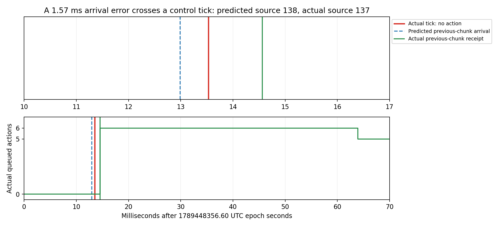
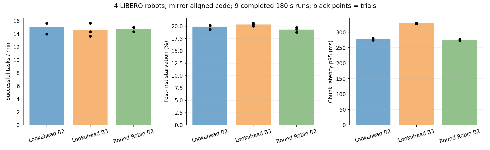

**Mirror 기준점 검증과 4대 스케줄러 비교 — deep9, 2026-09-15**

GPU 없는 mirror/broker 정합성 검증과 공급 모델 128조건·latency 민감도 20조건, 그리고 실제 4대 LIBERO 스케줄러 비교 9회를 완료했다. 같은 알려진 관측의 시작 index를 어긋나게 하던 mirror 문제를 재현하여 수정했다. 실제 로그에서도 알려진 관측 14,165건의 시작 index가 모두 일치했다. 다만 미래 tick과 도착 시점 예측 오차는 별도로 남아 있다.

**이번 4대·20 Hz 조건에서는 상한 3이나 단순 RR로의 교체가 성공 작업 수를 늘리지 않았다.** Lookahead B2는 성공 15.11개/분·action 부족 19.90%, B3는 14.56개/분·20.34%, RR B2는 14.78개/분·19.32%였다. RR의 부족은 0.58%p 낮지만 성공 작업 수는 증가하지 않았다. 세 번씩의 짧은 반복이고 온도·클록도 완전히 고정하지 않았으므로 작은 차이를 일반적인 우열로 주장하지 않는다. 공급 모델에서는 후보 정책 교체보다 추론 비용 감소의 영향이 컸지만, 어떤 스케줄러도 남은 부족을 제거할 수 없다는 최적성 증명은 아니다.

이번 후속 작업은 episode UUID 수정 후의 4대 실험을 출발점으로 삼았다. 이전 15회는 수정 전 동작의 자료이며, 그때의 “2대에서는 최대 batch 1이 유리하다”는 결론은 수정 후 재검증되지 않은 잠정 결과다. 기존 4대 6회와 이번 실행도 mirror 코드가 달라 별도 cohort로 보존한다. [고정 batch·Nsight 보고서](2026-09-15-fixed-batch-and-nsight.md)의 원본 수치는 변경하지 않는다.

**동일 관측으로 재현한 문제**

실제 `PolicyAgent.get_action()`과 `ActionChunkBroker`를 호출하고, 동일한 관측·응답·가상 시간을 mirror에 전달했다. action이 있는 상태, queue가 빈 상태, 응답이 control tick 직전/직후 도착하는 경우를 확인했다. 1 Hz와 실제 설정인 20 Hz 모두 검사했다. source index뿐 아니라 도착 시 수용할 suffix, queue 순증가량, 그 뒤 매 tick의 action index와 부족 여부를 대조했다.

클라이언트는 action을 pop한 뒤의 `next_action_step`을 요청에 넣는다. 원래 mirror의 `calculate_chunk_context()`는 같은 tick에서 실행 대상으로 꺼낸 `action_step`을 사용했다. 예를 들어 실제 요청이 1을 보낼 때 mirror는 0을 예측했다. action이 계속 있을 때 차이가 생기고 null action일 때는 증가가 없어 차이가 사라졌다. slot을 갱신하지 않는 조건에서도 재현됐다.

또한 완료 응답에 실제 observation step과 시작 index가 들어 있어도, `_recompute_from()`이 이를 도착 시각에서 다시 계산한 원관측 정보로 덮어썼다. 테스트에서는 실제 observation step 1이 3으로 바뀌었다. 완료 응답의 출처는 이미 알려진 사실이므로 도착 시각 보정과 분리해야 한다.

수정은 클라이언트의 기존 post-pop 전송 계약에 mirror를 맞추는 것이다. 임의로 모든 index에 1을 더하지 않고 `next_action_step`을 사용했다. 완료 응답은 실제 원관측과 시작 index를 보존하고 수신 이후 실행 context만 보정한다. ACK로 확인한 context도 다시 추정하지 않는다. 현재 클라이언트의 실제 action 배열·pop·전송 순서는 변경하지 않았다. 따라서 이 수정은 mirror의 일관성에 대한 것이며 관측 생성부터 실제 actuator 적용까지의 물리 시간 정합성을 새로 측정한 결과는 아니다.

최초 재현 테스트 8개 중 수정 전 6개가 실패했고 2개가 통과했다. 수정 후 20 Hz 경계까지 확장한 14개 테스트가 통과했다. 기록은 `output/mirror_alignment_20260915/before_tests.txt`, 테스트 코드는 `tests/scheduling/mirror_broker_alignment_test.py`다. serving·broker·mirror·OpenPI 관련 검증도 수행했다. GPU 실행 코드는 `11538d7`에서 고정했다. 실행 중 추가한 커밋은 분석·테스트만 변경했다. manifest의 Git HEAD가 달라도 `src/`, `armory-client/`, 설정과 serve/run/sweep 진입점은 동일했음을 `runtime_code_verification.json`에 남겼다.

**실제 로그에서 구분하는 세 기준점**

예측 시점에 forecast observation step, forecast start, 선택한 request ID·observation step·start를 값으로 저장했다. 실제 처리 request ID는 worker 로그에서 연결하고 실제 index는 broker의 pop 기록과 대조했다. 서버가 최신 slot을 읽는 동작 자체는 유지했다.

오차는 다음 세 부분으로 분해하며, 합이 전체 차이와 정확히 같음을 검사한다.

```
실제 처리 start - 예측 start
  = 같은 예측 관측에서 실제 broker start - 예측 start
  + 선택한 관측 start - 같은 예측 관측의 실제 start
  + 실제 처리 관측 start - 선택한 관측 start
```

episode가 끝난 뒤의 미래 observation step을 예측한 경우에는 그 관측이 실제 기록에 없으므로 같은 관측 검증에서 제외하고 coverage를 명시한다. 단순히 모든 +1 차이를 버그로 세거나 slot 갱신과 합산하지 않는다.

| 조건 | 처리 | 선택 후 slot 갱신 | 알려진 관측 / index 오류 | 기록된 미래 관측 / index 오류 | 미래 관측 미기록 |
| --- | ---: | ---: | ---: | ---: | ---: |
| Lookahead B2 | 4,714 | 282 | 4,386 / 0 | 218 / 0 | 110 |
| Lookahead B3 | 5,646 | 388 | 5,175 / 0 | 362 / 55 | 109 |
| Round Robin B2 | 4,807 | 87 | 4,604 / 0 | 87 / 0 | 116 |

알려진 관측의 계약 불일치는 14,165건 중 0건이었다. 기록에 있는 미래 관측 667건 중 55건은 B3에서 실제 start가 예측보다 1 작았다. 미래 관측 335건은 모두 해당 episode의 마지막 기록 tick보다 이후여서 실제 기록에 없음을 확인하고 오류율 분모에서 제외했다 (`boundary_validation.json`). 전체 처리 start와 forecast start의 차이는 slot 갱신과 미래 예측을 포함하므로 이 표의 알려진 관측 오류와 같지 않다.

시작 index가 맞더라도 도착 시점의 수용 suffix 예측이 항상 같은 것은 아니다. 알려진 동일 관측을 실제로 처리했고 추론·수용 모두 episode의 마지막 기록 tick 이전인 응답만 비교하면 다음과 같다.

| 조건 | 비교 응답 | suffix 개수 일치 | 평균 절대 오차, action 수 |
| --- | ---: | ---: | ---: |
| Lookahead B2 | 4,234 | 4,189 (98.94%) | 0.0106 |
| Lookahead B3 | 4,994 | 4,908 (98.28%) | 0.0172 |
| Round Robin B2 | 4,508 | 4,438 (98.45%) | 0.0155 |

잔여 201건은 모두 action 1개 차이였다. 이는 기준점 수정과 별도로 도착 시간·control tick 예측 오차를 평가해야 함을 보여준다. 수용 suffix 수는 기존 queue를 교체한 뒤의 순증가량과 다르며, 실제 순증가·기록 실행 action은 아래에서 별도로 집계한다.

미래 tick 예측 오차의 구체적 사례는 lookahead B3 1회차의 robot 0, batch 76이다. 선택한 관측은 step 176/start 137이었다. mirror는 step 177에서 action을 하나 실행할 것으로 보고 start 138을 예측했지만, 실제 step 177은 queue가 비어 null action이었고 처리 관측의 start는 137이었다. 그 직전 chunk 204의 예측 도착은 1789448356.612990, 실제 tick 177은 .613531, 실제 수용은 .614561이었다. **1.57 ms의 도착 오차가 control tick 경계를 넘어 미래 action 유무를 바꿨다.** 이후 tick 178에서 action 137이 실행됐다. 이는 이미 아는 관측의 post-pop 계약 오류와 구별해야 하며, 실제 제어 tick jitter도 함께 작용한다.



원본 시간·queue 자료와 PNG/PDF는 `output/scheduler_followup_20260915/examples/future_tick_boundary.*`에 보존했다.

**추론을 시작할 때 남은 실행 여유**

추론 시작 시각 이전의 마지막 broker 이벤트에서 queue 길이를 구했다. 마지막 control tick의 시각과 20 Hz 주기로 다음 tick을 추정하고, 기존 queue만으로 버틸 수 있는 시간을 계산했다. 이를 실제 추론 시작→broker 수용 시간과 비교했다. 이벤트 timestamp가 queue 변경 시작과 가깝지만 원자적 완료 시각 그 자체는 아니며, 실제 tick에도 jitter가 있으므로 **추정 slack**이라고 부른다. 후속 응답이 없었을 세계의 소진 시각을 직접 측정한 것은 아니다. episode 종료 및 전송되지 않은 응답은 실제 수용 지연 비교에서 제외한다.

| 조건 | 비교 수용 응답 | 시작 시 queue 평균 | 추정 여유, ms | 실제 추론→수용, ms | 지연−여유 평균, ms | 지연이 여유보다 큰 비율 |
| --- | ---: | ---: | ---: | ---: | ---: | ---: |
| Lookahead B2 | 4,521 | 2.58 | 154.16 | 224.90 | 70.75 | 73.06% |
| Lookahead B3 | 5,410 | 3.83 | 216.30 | 272.38 | 56.09 | 72.88% |
| Round Robin B2 | 4,606 | 2.72 | 160.88 | 225.06 | 64.19 | 66.24% |

상당수 추론은 기존 queue가 버틸 것으로 추정한 시간보다 응답까지 더 오래 걸렸다. 이는 부족이 추론 중 발생한다는 사실을 구체화하지만, 시작 시점을 앞당길 수 있었는지나 다른 순서가 더 좋은지는 증명하지 않는다. 응답 단위의 이 비율을 control step 단위의 부족 비율과 동일시하지 않는다. 표의 지연−여유 평균에는 음수도 포함한다.

**GPU 없이 비교한 공급 모델**

실제 `ActionChunkBroker`와 저장소의 lookahead, Round Robin, max-batch(EDF 정렬 뒤 상한까지 채움), greedy-deadline(지연에 맞는 크기 선택) 구현을 사용했다. 가상 시계에서 요청·추론 완료·응답·ACK를 전달하고, worker의 최신 slot 읽기와 최소 서비스 간격 조건도 적용했다. 로봇은 4대, 20 Hz, Hmin=1/Hmax=10, 가중치 1이다.

물리 환경·정책의 action 값·작업 성공·episode 종료는 모델링하지 않았다. 영상 전송을 실제 수행하지 않고 관측 지연 2 ms, 응답 지연 1 ms를 고정했다. 추론 비용은 batch 크기별 상수 평균이다. 실제 latency tracker의 예측 오차와 CPU 스케줄링 비용 변동도 없다. 따라서 공급 가능성을 보는 민감도 분석이며 실제 task 성공률이나 전역 최적 스케줄의 상·하한이 아니다.

비용은 고정 입력의 isolated 평균과, 이전 수정 후 6회에서 실제 batch별 추론 시간을 합쳐 계산한 동시 시뮬레이터 실행 평균을 각각 사용했다. 후자는 B1=151.39, B2=222.71, B3=277.55, B4=329.76 ms다. 프로파일러 실행은 비용 입력에 넣지 않았다.

네 스케줄러 × 상한 1~4 × 두 비용 표 × 추론 사이 공백 0/5 ms × tick 동기/엇갈림의 128개 조건을 60초씩 계산했다. 엇갈림은 네 로봇의 tick phase를 0/12.5/25/37.5 ms로 둔다. 첫 5초는 제외하므로 조건당 4,400개 control tick을 평가했다. 충분히 빠른 추론(1 ms)의 대조에서는 400/400개 tick에 action이 공급되는 것도 확인했다. worker 필터를 추가하기 전·후의 최종 128개 결과는 동일했고 해당 조건들에서 worker가 거부한 요청은 0개였다.

동시 실행 비용·5 ms 공백에서 두 tick phase의 평균 부족 비율은 다음과 같다. 단위는 %이며 반복 실험의 통계적 평균이 아닌 두 결정론적 phase 조건의 평균이다.

| 스케줄러 | 상한 1 | 상한 2 | 상한 3 | 상한 4 |
| --- | ---: | ---: | ---: | ---: |
| lookahead-actions | 23.98 | 19.91 | 21.05 | 25.02 |
| round-robin | 23.98 | 19.84 | 22.77 | 25.17 |
| max-batch | 23.98 | 19.86 | 21.02 | 25.17 |
| greedy-deadline | 23.98 | 20.39 | 21.30 | 26.43 |

lookahead B2와 가장 좋은 단순 후보인 RR B2의 차이는 약 0.07%p였다. lookahead B2의 5 ms 공백을 제거하면 평균 부족이 19.91%→19.19%로 약 0.72%p 줄었다. isolated 비용 표의 B2에서는 같은 두 정책이 약 14.61%/14.63%였다. 동시 실행 비용을 사용하면 실제 첫 B2 실행의 약 20% 부족과 규모가 비슷해지지만, 이것이 전체 실험 분포에 맞춰 검증한 모델이라는 뜻은 아니다.

별도로 동시 실행 비용을 모든 B에서 같은 비율로 줄이는 20개 가정을 계산했다. 4대 tick을 엇갈리게 하고 gap=5 ms인 lookahead B2의 부족은 비용 배율 1.0/0.9/0.8/0.7에서 19.91%/13.91%/6.52%/0%였다. RR B2도 거의 같았다. 30%의 실제 속도 개선이 가능하다고 주장하지 않으며, 이 모델에서 비용 감소의 영향이 정책 교체보다 크다는 뜻이다. 상한 3 등 일부 조건은 tick과 batch의 정렬 때문에 비용 감소에 대해 단조롭지 않았다.

도표는 `output/mirror_alignment_20260915/supply_model/scheduler_supply.png`와 `latency_sensitivity.png`이고 PDF도 보존한다.

비교한 후보에서는 비용이 같은 상태에서 단순 스케줄러와 lookahead의 차이가 작았다. 그러나 유한한 네 정책을 비교했을 뿐이므로 남은 부족을 “어떤 scheduler로도 제거할 수 없다”고 결론 내리지는 않는다. 반대로 추론 비용을 낮췄을 때 모델의 부족이 크게 줄어드는 결과도 실제 구현에서 그만큼의 속도 개선이 가능하다는 뜻은 아니다. 상태 모델이 완벽하다는 가정, 일정한 비용과 통신 지연, episode가 없는 조건에 의존한다.

**실제 GPU 비교 설계**

CPU 비교에서 단순 baseline은 Round Robin의 상한 2가 유리했으므로 이를 실제 비교에 선택했다. 비교 조건은 수정된 lookahead 상한 2, 빠져 있던 상한 3, Round Robin 상한 2다. 각각 180초씩 3회이며 cyclic 순서로 모든 조건이 첫 번째·중간·마지막에 한 번씩 오도록 했다. 매회 새 서버를 시작하고 warmup은 평가 시간에 포함하지 않았다.

RTX A6000 GPU 0 한 장에서 정책과 LIBERO를 함께 실행했다. pi05_libero, SYNC, denoising 10, task [5,2,6,9], seed [7,8,9,10], 최대 episode 500 step, 20 Hz, Hmin=1/Hmax=10, 동등 가중치를 유지했다. lookahead는 depth=1, max inflight=1, step budget=8이다. 모든 조건에서 broker 이벤트와 결정 시점 예측 기록을 켰고 Nsight는 사용하지 않았다. 총 9회는 이번 코드 버전끼리 비교한다.

각 조건은 180초 × 3회다. ±는 실행 간 표본 표준편차이며 신뢰구간이 아니다. p95 열은 실행별 p95의 평균이다.

| 조건 | 성공 작업/분 | 첫 action 이후 부족 step | chunk 지연 p95, ms | 실제 평균 batch |
| --- | ---: | ---: | ---: | ---: |
| Lookahead B2 | 15.11 ± 0.96 | 19.90% ± 0.45%p | 277.95 | 1.980 |
| Lookahead B3 | 14.56 ± 1.02 | 20.34% ± 0.30%p | 328.74 | 2.846 |
| Round Robin B2 | 14.78 ± 0.38 | 19.32% ± 0.47%p | 275.10 | 1.999 |



부족은 첫 모델 action 이후 null action을 사용한 기록 step의 비율이며 wall time 비율이 아니다. chunk 지연은 저장된 응답의 요청 timestamp→broker 수용 시각이다. 관측 생성부터 actuator 적용까지의 전체 지연과는 다르다.

| 조건 | 서버 처리 chunk/s | 기록 모델 action/s | chunk당 실행 action | chunk당 queue 순증가 | chunk당 지난 prefix | chunk당 기존 action 교체 |
| --- | ---: | ---: | ---: | ---: | ---: | ---: |
| Lookahead B2 | 8.730 | 60.939 | 7.266 | 7.376 | 2.571 | 0.053 |
| Lookahead B3 | 10.456 | 60.465 | 6.029 | 6.100 | 3.807 | 0.093 |
| Round Robin B2 | 8.902 | 60.630 | 7.093 | 7.199 | 2.707 | 0.094 |

B3는 B2보다 서버 처리 chunk가 932개 늘었지만 기록된 실행 action은 256개 줄었다. 지난 prefix가 chunk당 약 2.57→3.81개로 늘었다. RR B2는 부족 비율이 조금 낮아도 성공 작업 수와 기록 action/s가 B2보다 높지 않았다. reset으로 제외되는 초기 step 및 episode 길이가 조건에 따라 달라 지표들의 순위가 반드시 같지는 않다. 교체된 action에는 정상 재계획도 포함되므로 무조건 낭비로 간주하지 않는다. 네 로봇 모두의 부족 비율은 RR B2에서 조금 낮았으며, 특정 로봇 하나만 이득을 얻은 결과는 아니었다. 로봇별 수치는 `robot_conditions.csv`에 있다.

**연구 해석과 다음 분기**

이번 수정은 이미 구현된 실행 모델을 클라이언트의 계약과 일치시키는 검증 작업이다. “실제로 사용할 action을 고려한다”는 것 자체는 새 목적 함수가 아니다. Armory는 이미 실행 robot time을 보상으로 사용하며 timing 요구가 같은 구성에서 단순 baseline이 경쟁력 있음을 보고한다. [원 논문](https://arxiv.org/html/2608.00337v1)의 문제 정의와 겹치므로 구현 수정이나 이번 측정만으로 새로운 알고리즘의 신규성을 주장하지 않는다.

다음 모델 실행 최적화에서는 `infer_batch` 안의 입력 준비 구간을 noise 생성·입력 변환·batch/device 준비로 나눠 측정하는 것이 후보가 될 수 있다. 이전 Nsight의 해당 구간 전체를 불필요한 CPU overhead로 계산하거나 `cuStreamSynchronize` 대기를 GPU 실행 시간에 더하지 않는다. 이번에는 모델 실행 경로를 변경하지 않아 스케줄러 비교와 섞이지 않는다.

실제 공유 링크 실험에는 deep9 밖의 클라이언트와 링크 정보가 필요하다. 사용할 링크가 확인되기 전에는 현재 loopback 결과를 대역폭 병목의 증거로 사용하지 않는다. 별도 실험에서는 유효 대역폭·RTT를 먼저 측정하고, 네 로봇의 송신이 합쳐지는 하나의 병목에서 상태 갱신 유지+이미지 전송 빈도 조절을 단순 baseline으로 둔다. 과거 이미지에 새 state나 timestamp를 붙이지 않고 원래 observation snapshot·episode UUID를 유지해야 한다. 공용 서버의 qdisc·라우팅·NIC 설정은 이번 작업에서 변경하지 않았다.

**재현 명령과 자료**

```bash
.venv/bin/pytest -q tests/scheduling tests/serving tests/backends/openpi_adapter_test.py
.venv/bin/python -m scripts.simulate_action_supply --output output/new_supply_model --latency-sensitivity
.venv/bin/python -m scripts.run_scheduler_followup \
  --output output/new_scheduler_followup --gpu 0 --seconds 180 --repeats 3
.venv/bin/python -m scripts.analyze_scheduler_followup output/new_scheduler_followup
.venv/bin/python -m scripts.analyze_chunk_usage output/new_scheduler_followup/lookahead-actions
.venv/bin/python -m scripts.analyze_chunk_usage output/new_scheduler_followup/round-robin
```

`simulate_action_supply`의 비용 입력은 `output/fixed_batch_20260915/summary.csv`와 `output/local_followup_20260915/run_r4_*/policy/server/batches.jsonl`이다. 출력은 새 디렉터리를 지정해야 한다. 실제 GPU runner는 시작 전 compute 프로세스 및 포트를 확인하고 실행 중 다른 사용자의 GPU 작업이 나타나면 멈춘다. 이 검사는 연구실의 예약 규칙을 대신하지 않는다.

원본은 `output/mirror_alignment_20260915/` 및 `output/scheduler_followup_20260915/`에 있다. 각 GPU 실행의 manifest에 명령·commit·조건·완료 상태를 남겼다. `mirror_audit/provenance_and_slack.csv`는 예측 출처와 slack, `event_analysis`는 응답 경로, `chunk_usage`는 기록 action의 실제 사용처를 담는다. 가중치·raw 로그·개인 캐시는 Git에 올리지 않는다.

**검증 범위와 남은 제한**

총 **461개 episode, 126,750개 기록 step, 14,561개 저장 chunk**를 검증했다. 모든 기록 action과 queue 깊이가 실제 broker 이벤트 및 재구성 결과와 일치했고, action 수량 분해가 보존됐다. 다른 episode 응답의 저장·적용은 0건이었다. 관련 전체 테스트는 **80개 통과**했다 (`post_startup_fix_tests.txt`).

| 응답 경로, 9회 합계 | 개수 |
| --- | ---: |
| 서버 처리 | 15,167 |
| 전송 완료 | 14,943 |
| 클라이언트 수용 / ACK | 14,936 |
| episode 저장 | 14,561 |
| 서버 이전 세대 폐기 | 222 |
| 클라이언트 이전 세대 폐기 | 7 |
| 구조화된 전송·폐기 이벤트 없음 | 2 |

수용됐지만 snapshot에 없는 375개는 원 episode의 마지막 기록 step 이후 응답이었다. 구조화된 전송·폐기 이벤트가 없는 2개는 RR B2 1회차 request 14085와 B3 3회차 request 14087이며 모두 robot 0의 마지막 실행 구간이다. 각 서버 종료 로그에 `No active connection for robot robot_0, dropping response`가 한 번씩 있어 연결 종료 뒤 router에서 버린 응답으로 해석된다. 다만 해당 텍스트 로그에는 request ID가 없어 정확한 ID 연결을 입증한 구조화 기록으로 취급하지 않았다. 따라서 `unobserved_delivery=2`를 유지한다. 이 2개는 수용·ACK·저장 기록이 모두 없으며 실제 기록 action 검증에는 포함되지 않는다.

GPU 온도·SM clock·전력·thermal slowdown 상태를 약 10초마다 읽기만 했다. 첫 실행은 시작 약 55초 후부터 수집돼 앞부분이 빠졌고 나머지는 각 18개 실행 중 샘플이다. warmup·저장·idle 샘플은 아래 표에서 제외했다.

| 조건 | 실행 중 샘플 | SM clock 평균, MHz | 온도 평균 / 최대, °C | SW thermal Active 샘플 |
| --- | ---: | ---: | ---: | ---: |
| Lookahead B2 | 49 | 1692.6 | 84.82 / 88 | 6 |
| Lookahead B3 | 54 | 1662.8 | 85.20 / 88 | 8 |
| Round Robin B2 | 54 | 1668.6 | 84.39 / 88 | 9 |

HW thermal Active 표시는 수집 샘플에서 0건이었다. 온도와 clock은 고정하지 않았고 SW thermal 표시가 일부 관측됐으므로 완전히 같은 클록 조건의 비교라고 주장하지 않는다. cyclic 실행 순서가 시간 경과에 따른 편향을 줄이지만 제거하지는 않는다. GPU power·clock·fan·드라이버 및 서버 네트워크 설정은 변경하지 않았다. GPU 측정과 telemetry 프로세스는 모두 종료했다.

별도의 CPU 서버 lifecycle 테스트가 최종 점검 중 한 번 `KeyError: robot-a`로 실패했다. scheduler의 해당 로봇 warmup 지연값이 없었다. worker ready 이벤트는 SUB 구독이 실제로 연결됐다는 보장이 아니며, 부모 프로세스가 PUB를 bind한 직후 애플리케이션이 요청을 받으면 초기 warmup/control 메시지가 유실될 수 있었다. 재시도는 통과했지만 결과를 덮어쓰지 않고 최초 실패 로그를 남겼다.

진행 중인 cohort와 분리한 worktree에서 XPUB로 두 worker의 구독을 확인한 뒤 애플리케이션이 요청을 받도록 수정했다. 연결 대기는 최대 10초이며 실패하면 worker·소켓을 정리한다. 이는 [libzmq의 XPUB 구독 알림](https://libzmq.readthedocs.io/en/latest/zmq_setsockopt.html)을 사용하며 임의의 sleep으로 우회하지 않는다. 별도 회귀 테스트에서 두 구독 확인·첫 제어 메시지 전달·누락 시 timeout·실패 시 자원 정리를 검증했고, 실제 3-process mock lifecycle도 3회 연속 통과했다. 이 시작 순서 수정은 9회 GPU 측정 종료 후 적용하여 실행 도중 serving 코드가 달라지지 않도록 했다. 이번 GPU 9회에서는 네 로봇 모두 scheduler의 warmup seed 수신 로그가 있음을 확인했다. 초기 실패와 수정 후 로그는 `output/mirror_alignment_20260915/`에 구분하여 보존했다.

이번 결과는 같은 task·seed 묶음을 반복한 세 번의 짧은 실험이다. 여러 독립 seed나 서로 다른 timing 요구로 일반화한 검증이 아니며, 작은 평균 차이만으로 통계적 우월성을 주장하지 않는다. 기존 수정 후 B2/B4 cohort와도 코드가 달라 효과를 합산하지 않는다. mirror 수정 전후의 성능 효과를 단독으로 추정하는 무작위 교차 실험도 아니다.
