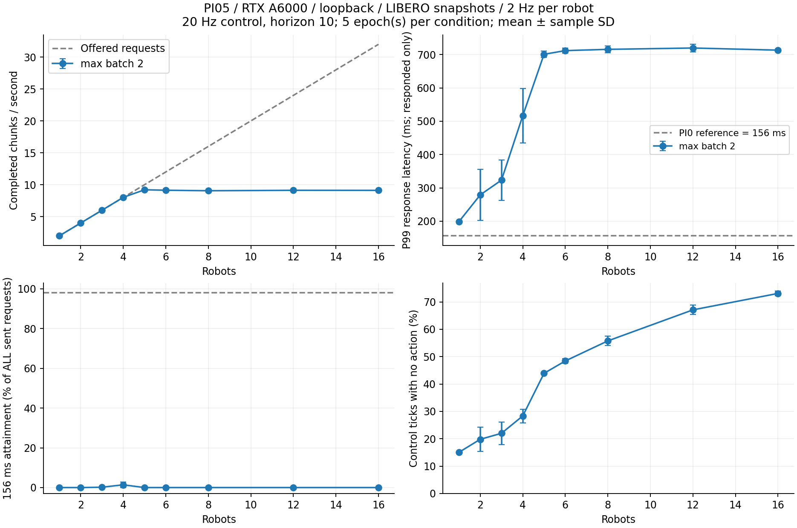
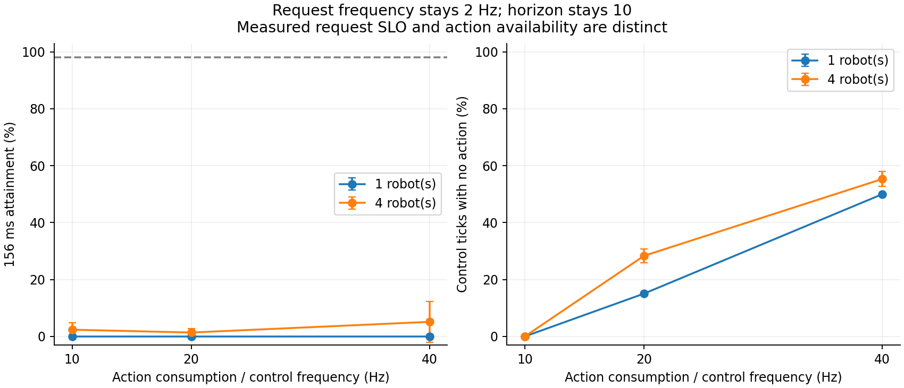

# 로봇 수 증가와 SLO / action 부족 비교

## 목적과 비교 범위

정적 batch 1–5 측정 다음 단계로, 실제 π0.5 서버에 주기적 local 요청을 보내
serving 부하 한계와 action 가용성의 관계를 측정한다.

[Robion §5.1](https://arxiv.org/html/2609.12075v1#S5.SS1)의 π0 참고 deadline은
156ms이다. Jetson AGX Thor의 70W 모드 추론 지연에서 정한 값이며,
156ms가 action chunk 길이나 로봇 제어 주기에서 도출된 값은 아니다.
논문은 기본 요청 빈도 2Hz, 무작위 초기 위상, 5개 epoch 평균을 사용하고,
98% SLO 충족률을 유지하는 로봇 수를 평가한다.

여기서는 이 방법과 **π0의 156ms 참고값**을 가져온다. 실제 실행 모델은
π0.5 LIBERO이고 하드웨어는 RTX A6000 한 장, 통신은 loopback이다.
따라서 Robion 재현이나 π0.5 고유 SLO 검증으로 해석하지 않는다.

## 측정 조건

- GPU 0: RTX A6000, UUID `GPU-48f8ed9c-ab6c-5134-2277-bd7e0f487b4b`.
- 모델: `pi05_libero`, JAX SYNC, denoising 10회, action horizon 10.
- 서버: `lookahead-actions`, 최대 batch 2. 실제 batch 크기는 로그로 확인.
- 입력: `output/static_inputs_20260917`의 LIBERO 관측 5개를 반복 재생.
  5대 초과 시 robot index modulo 5로 배정한다. 파일 SHA256을 매번 검사한다.
- 이미지 2장: 각각 `(224,224,3) uint8`, state `(8,) float64`, 원래 task prompt.
  모델 입력 변환 및 shape/dtype은 앞선 정적 실험과 같다.
- 실제 WebSocket, GPU 모델 추론, PolicyAgent, ActionChunkBroker와 ACK 경로 사용.
  시뮬레이터 렌더링이나 물리 상태 변화, task 성공률은 측정하지 않는다.
- 요청: 응답 도착 여부와 무관하게 각 로봇 2Hz, 초기 위상 `Uniform[0,0.5)`.
- 제어: 기본 20Hz, min execution horizon 1, max execution horizon 10.
- 각 조건: 5초 warmup + 최대 초기 위상 0.5초 제외 후 20초 측정.
  측정 종료 뒤에도 1초간 요청 부하를 유지하고, 추가 2초 동안 응답을 수신한다.
- 각 조건 5회 반복. 반복마다 위상을 다시 뽑으며 로봇 수 조건 순서를 순환한다.
- GPU 설정 변경 및 GPU profiler 사용 없음. 읽기 전용 GPU telemetry 기록.
  다른 compute 작업이 같은 GPU에 나타나면 실험을 중단한다.

## 지표 정의

1. **SLO 충족률**: 측정 구간에 발행한 모든 요청 중, 발행 직전 timestamp부터
   클라이언트 broker 수신 처리 시점(큐 lock 획득 후 기록한
   `response_timestamp`)까지 156ms 이내인 비율. 큐 대기, 추론,
   직렬화와 loopback 전달, 클라이언트 처리 지연을 모두 포함한다.
   응답이 없는 요청도 분모에 남는다. Armory의 latest-slot 교체 의미는
   Robion의 FIFO 요청 처리와 다르므로 미응답 수를 따로 보고한다.
2. **응답 지연 p99**: 실제 응답한 요청에 한한 p99. 미응답은 포함되지 않으므로
   SLO 충족률 및 미응답 수와 반드시 함께 읽는다.
3. **처리량**: 측정 시간 안에 도착한 action chunk 수 / 20초.
   발행 구간으로 잡은 SLO cohort와 도착 구간으로 잡은 처리량은 분모가 다르다.
4. **Action 부족률**: warmup 이후 실제 제어 tick에서 broker가 실행할 action을
   반환하지 못한 비율. null action 대체를 부족으로 센다. 로봇별 비율도 저장한다.
5. **교차표**: 한 요청 발행부터 다음 요청 발행 직전까지의 완전한 요청 주기에
   action 부족 tick이 있었는지와, 그 요청의 SLO 통과 여부를 교차 집계한다.
   두 현상의 동시 관찰이며 특정 요청이 부족을 유발했다는 인과 판정은 아니다.
6. **보조 진단**: 실제 batch 크기, 추론 전 대기, 추론 지연, 제거된 chunk prefix,
   제어 tick 지연, 발행 요청 수, 미응답, 중복 응답, GPU 온도/clock/전력.

여기서 156ms는 결과 평가용 기준이다. Armory에 전달하는 scheduling deadline은
기존의 `request_time + remaining_actions/control_hz`를 유지한다.

## sparse observation 수정과 예비 실행

기존 `Robot.step()`은 매 제어 tick마다 관측이 온다고 가정한다. 20Hz 제어를
유지하면서 2Hz로 요청하면 action index가 여러 칸 증가하는 것을 잘못 처리하여
`Gap in steps` 예외로 서버가 종료됐다. 실패 로그는
`output/serving_capacity_smoke_20260917`에 보관했다.

`a528f91`에서 선택적 `action_executed` 필드를 추가했다. 현재 tick의 실제 실행
여부와 클라이언트의 누적 post-pop action counter로 mirror를 갱신한다.
전송하지 않은 중간 tick의 실행 시점은 만들어내지 않는다. 기존 연속 tick
요청과 미래 starvation 예측을 포함한 회귀 테스트 116개가 통과했다.
서버와 클라이언트는 함께 갱신한 버전을 사용한다.

수정 후 `output/serving_capacity_smoke_v2_20260917`의 1대/4대 예비 실행이 완료됐다.
예비 결과는 본 실험 평균에 포함하지 않는다.

## 재실행

```bash
.venv/bin/python -u -m scripts.benchmark_serving_capacity \
  --output output/serving_capacity_NEW \
  --robots 1 2 3 4 6 8 12 16 --batch 2 \
  --repeats 5 --seconds 20 --warmup 5
```

원시 로그에는 입력 checksum, 실행 commit, phase offset, 제어 tick,
요청/응답 ID, action queue 이벤트, 모델 metadata와 GPU telemetry를 보존한다.

## 해석 시 주의점

- 98% 충족 여부는 이 표본에서의 경험적 결과이며 장기적인 보장을 뜻하지 않는다.
  각 반복의 p99와 비율을 먼저 계산한 다음 5회 평균과 표본 표준편차를 보고한다.
- 156ms 외 deadline 결과는 같은 로그를 재평가한 민감도 분석이다. 새 SLO를
  측정 결과에 맞춰 선정하거나 Robion의 정의를 바꾼 것이 아니다.
- 성공적으로 응답한 요청의 지연만 보면 latest-slot 교체가 많은 과부하 구간을
  과소평가할 수 있다. 전체 발행 요청 기준 충족률과 미응답 수를 함께 본다.
- 제어 속도 변경은 고정 관측을 쓰는 action 가용성 실험이다. 실제 로봇에서
  제어 속도를 낮춰도 task 품질이나 안정성이 유지된다는 뜻은 아니다.
- 1초 간격 `nvidia-smi` 이용률 표본은 주기적 2Hz 트래픽과 위상이 겹칠 수 있다.
  이를 정밀한 GPU 활성 시간 비율로 해석하지 않는다. 온도와 clock 등 환경
  기록을 보존하되, 부하 한계는 실제 요청/응답/추론 이벤트로 판단한다.

## 3단계 결과: 로봇 수 증가

각 조건 5회 평균. p99는 각 반복의 응답 요청 p99를 평균한 값이다.

| 로봇 수 | 발행 요청/s | 수신 chunk/s | 156ms 충족률 | 미응답률 | action 부족률 | 응답 p99(ms) |
|---:|---:|---:|---:|---:|---:|---:|
| 1 | 2.0 | 2.00 | 0.00% | 0.00% | 15.05% | 198.6 |
| 2 | 4.0 | 4.00 | 0.00% | 0.00% | 19.80% | 278.8 |
| 3 | 6.0 | 6.00 | 0.17% | 0.00% | 22.00% | 323.3 |
| 4 | 8.0 | 8.02 | 1.38% | 0.25% | 28.34% | 516.6 |
| 5 | 10.0 | 9.21 | 0.00% | 7.60% | 43.90% | 701.1 |
| 6 | 12.0 | 9.14 | 0.00% | 23.92% | 48.42% | 712.1 |
| 8 | 16.0 | 9.06 | 0.00% | 43.62% | 55.76% | 715.9 |
| 12 | 24.0 | 9.13 | 0.00% | 62.04% | 67.09% | 720.0 |
| 16 | 32.0 | 9.12 | 0.00% | 71.59% | 73.09% | 713.5 |

최대 batch 2에서 처리량은 약 9.1–9.2 chunk/s로 포화했다. 4대에서는 요청을 거의 모두
수신했지만, 5대의 요청량 10건/s부터 미응답이 증가했다. 이는 **처리량 기준의 관찰**이다.
156ms·98% 기준은 실험한 어떤 로봇 수에서도 충족하지 못했다. 따라서 이 참고 deadline에서
98%를 만족하는 양의 로봇 수를 찾았다고 보고할 수 없다.

과부하에서 응답 요청의 p99는 약 710–720ms에 머무는데 미응답률과 action 부족률은
계속 증가했다. latest-slot 방식이 오래된 요청을 교체하므로 FIFO처럼 지연만 계속
늘어나는 형태가 아니다. 응답된 요청의 지연만으로 부하 한계를 평가하면 이를 놓친다.

낮은 부하에서는 빈 batch 반복도 관찰됐다. 1대 조건의 20초 측정 구간당 평균
3,946개가 추론 없이 종료됐고 실제 추론은 40개였다. 정적 batch 1 추론보다 serving이
느린 원인 후보이지만, 이 실험만으로 빈 batch가 원인이라고 확정하지 않는다.

높은 부하의 일부 GPU 표본에서는 software thermal slowdown flag가 활성화됐다.
GPU clock·냉각·power 설정은 변경하지 않았다. 결과는 해당 열 상태를 포함한 deep9의
실측치이며 clock을 고정한 하드웨어 고유 성능 상한으로 해석하지 않는다.

## 4단계 결과: 요청 빈도를 유지한 채 action 소비 속도 변경

요청 2Hz, horizon 10, 최대 batch 2를 유지했다. 1대/4대 × 10Hz/40Hz를 각각 5회
측정했고, 20Hz는 3단계의 동일 로봇 수 결과를 비교 기준으로 사용한다. 20Hz와
추가 조건은 서로 다른 서버 실행에서 측정했으므로 작은 지연 차이의 원인을
제어 속도 하나로 단정하지 않는다. 아래 값은 각 조건의 5회 평균이다.

| 로봇 수 | 제어 Hz | 수신 chunk/s | 156ms 충족률 | action 부족률 | 응답 p99(ms) |
|---:|---:|---:|---:|---:|---:|
| 1 | 10 | 2.00 | 0.00% | 0.00% | 202.4 |
| 1 | 20 | 2.00 | 0.00% | 15.05% | 198.6 |
| 1 | 40 | 2.00 | 0.00% | 50.00% | 198.0 |
| 4 | 10 | 7.99 | 2.38% | 0.00% | 382.4 |
| 4 | 20 | 8.02 | 1.38% | 28.34% | 516.6 |
| 4 | 40 | 8.01 | 5.12% | 55.34% | 504.2 |

1대에서는 SLO 충족률이 세 조건 모두 0%인데도 action 부족률은 0%, 15.05%, 50%로
달랐다. 4대에서도 10Hz에서는 action 부족이 없지만 40Hz에서는 55.34%였다.
40Hz 조건은 요청 공급량 자체의 한계를 의도적으로 드러낸다. 최대 공급이
`2 chunks/s × 10 actions/chunk = 20 actions/s`이므로, 40Hz 소비에서는 정상상태에
최소 50% 부족이 생긴다. 이를 GPU 또는 스케줄러의 성능 결함으로 해석하지 않는다.

세 조건의 응답 SLO 충족률이 모두 매우 낮으므로, 시스템 전체가 98% SLO 목표를
충족하면서도 action이 부족한 조건을 확보했다고 주장하지 않는다. 다만 **개별 요청**의
SLO 통과 여부와 action 부족이 다를 수 있다는 실제 사례는 확인했다.

### 실제 요청 사례

- `r4_hz20_rep0`, robot 1, request 459: 응답 149.18ms로 156ms를 통과했다.
  요청 시 action 큐는 비어 있었고, 요청 후 약 49.92ms와 99.95ms의 제어 tick에서
  action이 부족했다. 20Hz에서도 개별 요청 SLO 통과가 충분한 action 공급을 보장하지 않는다.
- `r1_hz20_rep0`, robot 0, request 12: 응답 197.78ms로 SLO를 초과했다.
  요청 tick 직후 기존 action이 3개 남아 있었고, 이후 다음 요청까지 부족이 없었다.
  약 50/100/150ms tick에서 기존 action을 사용한 뒤, 약 200ms tick 전에 응답이 도착했다.

이 예시의 원시 키와 시점은 `mismatch_examples.json`에 저장했다. 요청 주기 교차표는
원인 판정이 아니라 해당 주기에서 함께 관찰된 현상을 집계한다.

## 그래프와 산출물





- [반복별 결과](serving-capacity-20260917/epochs.csv)
- [조건별 평균과 표본 표준편차](serving-capacity-20260917/aggregate.csv)
- [GPU 상태와 빈 batch 진단](serving-capacity-20260917/diagnostics.csv)
- [요청 주기 교차표](serving-capacity-20260917/request_cycle_counts.csv)
- [deadline 민감도](serving-capacity-20260917/deadline_sensitivity.csv)
- [불일치 요청 사례](serving-capacity-20260917/mismatch_examples.json)

원시 실험 폴더:

```text
output/serving_capacity_20260917/           # 1,2,3,4,6,8,12,16대 × 5회
output/serving_capacity_boundary_20260917/  # 5대 × 5회
output/serving_slo_actions_20260917/        # 1,4대 × 10,40Hz × 5회
```

총 65개 측정 구간에서 요청 13,400개가 모두 서버에 도착했다. 이 중 8,553개는
응답을 받았고, 중복 응답은 0개였다. 제어 tick 139,000개를 기록했으며, 조건별
tick 지연 p99 중 최대값은 약 0.162ms였다. 모든 실험 상태는 complete이고,
실험 서버 종료 후 GPU compute process가 없고 GPU 메모리 사용량이 0MiB임을 확인했다.

실행 코드는 `a528f91`, 이후 실행의 HEAD는 분석 도구를 추가한 `75a71f2`다.
두 commit 사이에 측정/서버 코드는 바뀌지 않았다. 서버·클라이언트와 관련 회귀 테스트
116개가 통과했고, 최종 산출물은 전체 원시 로그에서 다시 생성했다.

### 후속 조건 및 분석 재실행

```bash
.venv/bin/python -u -m scripts.benchmark_serving_capacity \
  --output output/serving_capacity_boundary_NEW --robots 5 \
  --batch 2 --repeats 5 --seconds 20 --warmup 5

.venv/bin/python -u -m scripts.benchmark_serving_capacity \
  --output output/serving_slo_actions_NEW --robots 1 4 --control-hz 10 40 \
  --batch 2 --repeats 5 --seconds 20 --warmup 5

.venv/bin/python -m scripts.serving_capacity_diagnostics \
  output/serving_capacity_20260917 \
  output/serving_capacity_boundary_20260917 \
  output/serving_slo_actions_20260917 \
  --output docs/experiments/serving-capacity-20260917

.venv/bin/python -m scripts.plot_serving_capacity \
  docs/experiments/serving-capacity-20260917/epochs.csv \
  --output docs/experiments/serving-capacity-20260917
```

## 다음에 분리해서 검증할 문제

현재 결과는 request latency, 응답 coverage, action 가용성을 별도 지표로 다뤄야
함을 보여준다. 바로 더 많은 로봇을 추가하기보다, 새 관측이 없는 동안의 빈 batch
반복을 제거한 전후를 같은 2Hz 조건에서 비교하는 것이 다음 원인 분해 실험이다.
π0.5의 실제 배포 SLO를 확정하려면 해당 모델·설정의 on-robot 기준 또는 응용의
제어 요구가 별도로 필요하다. 이 결과만으로 새 스케줄러의 우월성이나 논문 신규성을
주장할 수는 없다.
