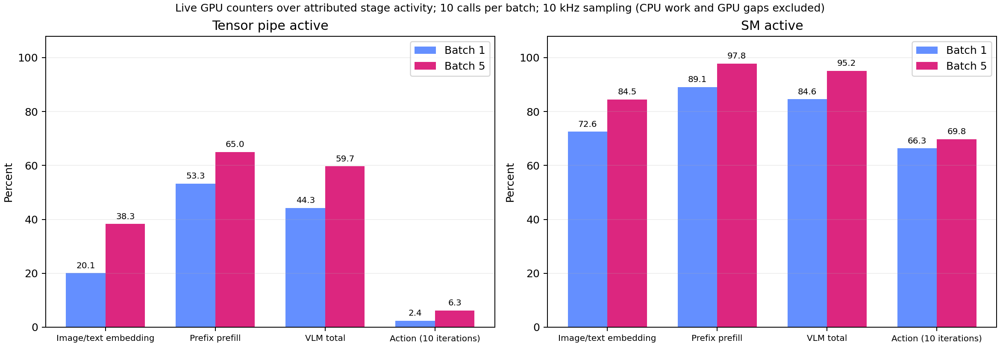
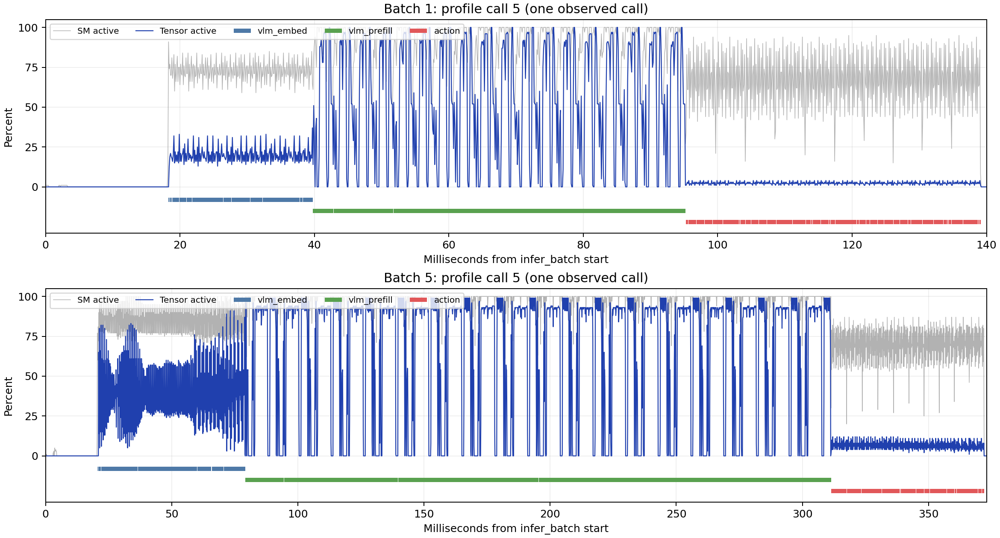

**π0.5 VLM·action 구간 자원 사용률 — deep9, 2026-09-17**

전체 구간의 실시간 GPU 카운터와 kernel별 NCU 진단을 추가 측정했다. 같은 입력에서 batch 1→5로 바꾸면 **VLM 전체 Tensor Active는 44.29→59.68%, action은 2.38→6.26%**였다. 이전의 prefill GEMM 91–94%를 VLM 전체 사용률로 읽으면 안 된다는 점을 구간 측정으로 확인했다.

이 퍼센트의 분모는 **해당 stage에 속한 GPU kernel·memcpy·memset 실행 시간의 합집합**이다. CPU 시간과 GPU 작업 사이의 빈 시간은 제외한다. 10kHz 표본을 시간 적분한 추정값이며, 연산량을 이론 최대 FLOPS로 나눈 MFU 또는 NCU의 직접 range 측정값은 아니다.

**실제 실행 구간의 카운터: Nsight Systems**

| Batch | 구간 | GPU 활동 ms | Tensor Active | SM Active | SM Issue | DRAM Read | DRAM Write |
| --- | --- | ---: | ---: | ---: | ---: | ---: | ---: |
| 1 | 이미지·텍스트 embedding | 20.50 | 20.07% | 72.55% | 7.86% | 32.90% | 24.32% |
| 1 | prefix prefill (VLM shared 포함) | 55.35 | 53.26% | 89.08% | 11.84% | 38.02% | 17.80% |
| 1 | VLM 전체 | 75.85 | 44.29% | 84.62% | 10.77% | 36.63% | 19.56% |
| 1 | action 생성 10회 | 41.32 | 2.38% | 66.33% | 5.47% | 41.71% | 18.88% |
| 5 | 이미지·텍스트 embedding | 57.89 | 38.35% | 84.47% | 13.17% | 30.34% | 21.06% |
| 5 | prefix prefill (VLM shared 포함) | 231.58 | 65.01% | 97.82% | 12.29% | 32.22% | 14.66% |
| 5 | VLM 전체 | 289.47 | 59.68% | 95.15% | 12.47% | 31.84% | 15.94% |
| 5 | action 생성 10회 | 57.92 | 6.26% | 69.76% | 7.05% | 37.72% | 22.73% |

각 B에서 warmup 30회 뒤 공식 호출 10개의 평균이다. VLM total은 앞의 두 행을 합친 구간이며 별도 추가 작업이 아니다. SM Active는 warp가 할당되어 있는 SM의 활동률, SM Issue는 instruction 발행 활동률이다. **SM Active가 높아도 Tensor 파이프가 높게 사용된다는 뜻은 아니다.** DRAM Read/Write는 각각의 카운터 정의이며 그대로 더해 NCU DRAM 처리율과 같다고 보지 않는다. [NVIDIA GPU metrics 정의](https://docs.nvidia.com/nsight-systems/UserGuide/#gpu-metrics)





**요청한 지표와 수집 위치**

| 확인할 질문 | 수집한 값 | 해석 단위 |
| --- | --- | --- |
| 연산 자원을 얼마나 쓰는가? | 실시간 Tensor Active·SM Active·SM Issue, NCU SM throughput·HMMA Tensor pipe | 전체 stage GPU 활동 구간 / 개별 kernel을 구분 |
| 메모리 접근이 제한하는가? | NCU DRAM·L2 처리율, DRAM·L2 GB/s, L1/TEX·L2 hit rate | kernel replay의 캐시 조건 포함 |
| 실행 자원을 충분히 채우는가? | 실제·이론 occupancy, active·eligible·issued warp, no eligible, warp stall 원인 | 활성 cycle과 scheduler 기준, 추론 wall time 비율 아님 |

**NCU: 대표 kernel의 연산·메모리 지표**

B1 112개, B5 128개, 총 240개 kernel 표본을 수집했다. 아래는 기준 Nsight trace와 kernel 이름·grid·block·static/dynamic shared memory가 일치하고 stage 분류도 충돌하지 않는 대표 구성이다. 비중은 해당 stage의 **kernel 시간만** 분모로 한 기준 trace 비율이다. NCU replay 시간으로 stage 비중을 계산하지 않았다.

| B | 대표 kernel | stage kernel 시간 비중 | SM / Tensor % | DRAM % · GB/s | L2 % · GB/s | L2 hit % |
| --- | --- | ---: | ---: | ---: | ---: | ---: |
| 1 | 이미지 Ampere GEMM | 23.43% | 39.09 / 39.09 | 46.61 · 339.5 | 36.42 · 992.1 | 74.55 |
| 5 | 이미지 GEMM 59 | 24.43% | 54.86 / 54.86 | 21.82 · 159.0 | 72.70 · 1970.8 | 93.02 |
| 1 | prefill CUTLASS | 22.80% | 74.55 / 74.55 | 36.32 · 264.7 | 63.48 · 1731.0 | 87.77 |
| 5 | prefill CUTLASS | 42.37% | 91.58 / 91.58 | 36.82 · 268.4 | 61.48 · 1668.5 | 90.19 |
| 5 | prefill Ampere GEMM | 20.66% | 94.04 / 94.04 | 33.26 · 242.4 | 62.76 · 1704.8 | 89.40 |
| 5 | prefill transpose | 7.21% | 7.12 / 0.00 | 41.34 · 301.3 | 89.24 · 2420.9 | 91.69 |
| 1 | action MLP slice | 25.98% | 5.28 / 0.00 | 89.03 · 648.7 | 41.00 · 672.9 | 50.04 |
| 5 | action MLP slice | 17.43% | 5.35 / 0.00 | 89.04 · 648.6 | 40.37 · 672.9 | 50.04 |
| 5 | action GEMM 117 | 11.23% | 23.32 / 23.32 | 80.79 · 588.9 | 28.20 · 763.2 | 30.77 |

**NCU: 같은 kernel의 occupancy·warp·stall**

| B | 대표 kernel | 실제 / 이론 occupancy % | Active warp | Eligible warp | No eligible % | 가장 큰 stall · cycle/issued inst |
| --- | --- | ---: | ---: | ---: | ---: | --- |
| 1 | 이미지 Ampere GEMM | 8.33 / 8.33 | 1.01 | 0.11 | 88.74 | math_pipe_throttle · 3.15 |
| 5 | 이미지 GEMM 59 | 17.75 / 25.00 | 2.12 | 0.14 | 86.93 | long_scoreboard · 6.48 |
| 1 | prefill CUTLASS | 8.33 / 8.33 | 1.00 | 0.13 | 87.00 | math_pipe_throttle · 3.76 |
| 5 | prefill CUTLASS | 16.66 / 16.67 | 1.99 | 0.19 | 86.88 | math_pipe_throttle · 10.06 |
| 5 | prefill Ampere GEMM | 16.63 / 16.67 | 2.00 | 0.17 | 89.06 | math_pipe_throttle · 12.65 |
| 5 | prefill transpose | 72.83 / 100.00 | 8.82 | 0.12 | 92.86 | lg_throttle · 41.91 |
| 1 | action MLP slice | 85.78 / 100.00 | 10.40 | 0.05 | 96.71 | long_scoreboard · 236.25 |
| 5 | action MLP slice | 85.94 / 100.00 | 10.32 | 0.05 | 96.73 | long_scoreboard · 233.17 |
| 5 | action GEMM 117 | 8.33 / 16.67 | 1.02 | 0.09 | 90.57 | long_scoreboard · 4.37 |

Active/Eligible는 활성 주기에 대한 scheduler당 평균 warp 수다. Stall은 warp가 instruction 발행 사이에 각 상태에서 보낸 평균 cycle이며, 전체 GPU 시간의 퍼센트가 아니다. 소수의 큰 Tensor instruction이 연산 파이프를 오래 점유할 수도 있으므로, `No eligible`이 높다는 이유만으로 연산 장치가 모두 비어 있다고 해석하지 않는다.

- **큰 prefill GEMM:** B5 Tensor 91.58–94.04%, DRAM 33.26–36.82%. `math_pipe_throttle`이 가장 크다. 해당 표본은 Tensor 연산 자원의 높은 사용을 보여준다. occupancy 약 16.6%가 이론 한계와 거의 같아, 그 숫자만으로 비효율이라고 볼 수 없다.
- **prefill 안의 다른 연산:** transpose는 L2 처리율 89.24%, 약 2,421GB/s이며 DRAM은 41.34%다. `lg_throttle`, `long_scoreboard`, `mio_throttle`을 함께 확인했다. 별도의 convert kernel은 DRAM 93.97%다. 전체 prefill을 하나의 compute-bound 유형으로 단정하지 않는다.
- **action:** MLP slice는 B1·B5 모두 DRAM 약 89%, Tensor 0%, occupancy 약 86%인데 eligible warp는 0.05다. `long_scoreboard`가 주요 대기 원인이다. 이는 L1/TEX 경로의 메모리 결과를 기다리는 상태이며, 그 자체가 DRAM 문제만을 뜻하지는 않는다. 이 표본에서는 높은 DRAM 처리율과 함께 관찰돼 메모리 이동 비용을 우선 살필 근거가 된다. action GEMM 117도 B5 Tensor 23.32%, DRAM 80.79%로 큰 prefill GEMM과 다른 특성을 보였다.
- **이미지 embedding:** B5 상위 GEMM들의 Tensor 사용률은 약 48–73%로 서로 다르며 L2 처리율도 약 68–73%였다. 하나의 이미지 GEMM 수치로 전체 이미지 처리의 활용률을 대신하지 않는다.

전체 kernel 표와 L1/TEX hit rate, L2 hit rate, register/shared-memory 사용량, 모든 stall 원인은 [kernel CSV](data/2026-09-17-stage-resources-ncu-kernels.csv)에 있다. 사용한 정확한 metric 이름과 단위는 [검증 JSON](data/2026-09-17-stage-resources-ncu-validation.json)에 보존했다. `SM throughput`은 NCU의 처리율 지표이며 위 Nsys `SM Active`와 같은 지표가 아니다.

자동튜닝 차이·공유 stage·분류 충돌을 제외하고 기준 kernel 시간과 정확히 연결된 coverage는 다음과 같다. 따라서 가중 진단 CSV를 전체 구간 사용률로 제시하지 않는다.

| B | 이미지 embedding | prefill | action |
| --- | ---: | ---: | ---: |
| 1 | 82.25% | 69.26% | 68.87% |
| 5 | 95.88% | 99.30% | 85.19% |

B5 `input_reduce_fusion_7` 한 표본은 기준 trace와 자체 HLO의 stage 정보가 충돌해 비교에서 제외했다. B1 14개, B5 8개 표본은 이 충돌을 포함해 정확한 비교 연결이 없으며, 원본 counter는 보존했다. 공유 stage 표본도 B1 5개, B5 3개를 가중 요약에서 제외했다.


**왜 action의 Tensor 사용률이 낮은가?**

action은 큰 GEMM만 실행하지 않는다. Nsight trace에서 `loop_slice_fusion_3`는 호출당 **180회** 나타나며, batch 1에서는 **9.006ms**, batch 5에서는 **8.902ms**였다. 각각 action 전체 GPU 활동 시간의 **21.80%, 15.37%**다. kernel 실행 시간만 분모로 잡은 비율과 혼동하지 않는다.

NCU 실행의 optimized HLO에서 입력은 `bf16[18,2,1024,4096]`, 출력은 `bf16[1,1,1024,4096]`와 `bf16[1,1024,4096]`이다. 출력 두 개의 논리 크기 합은 16MiB다. 이는 batch 이미지나 prompt가 아니라 action expert의 MLP gating 가중치 분리와 연결된다. 소스의 `self.w_gating[0]`, `self.w_gating[1]`에 대응하며, 18개 층 × denoising 10회와 일치한다. 논리 출력 byte 수 자체를 실측 DRAM traffic으로 대신하지는 않는다.

이 결과는 **반복적인 가중치 slice·layout 준비를 loop 밖으로 옮기거나 재사용할 수 있는지**를 다음 최적화 가설로 제시한다. 이미 최적화 가능성이나 실제 절감량을 입증한 것은 아니다. 구현을 바꾸면 GPU 메모리 증가, JIT 최적화 변화, 출력 일치, 일반 추론 latency를 다시 검증해야 한다. VLM과 action의 다른 자원 사용 특성을 serving scheduling으로 연결하려면 제어 deadline과 다중 로봇 실험도 필요하다.

**수집 조건과 검증**

- `pi05_libero`, JAX SYNC, denoising 10회, action horizon 10. 원래 monolithic JIT와 CUDA graph 기본값을 유지했다. stage를 나눠 JIT하거나 내부 GPU barrier를 추가하지 않았다.
- 입력은 `output/static_inputs_20260917`의 같은 LIBERO snapshot, B마다 앞 B개 요청, RNG seed 7. 모델 입력: 이미지 3 slots `(B,224,224,3) float32` (한 slot masked padding), prompt `(B,200) int32`, state `(B,32) float32`. 내부 bf16, 결과는 요청당 `(10,7)`.
- GPU 0 RTX A6000, GPU UUID `GPU-48f8ed9c-ab6c-5134-2277-bd7e0f487b4b`. Driver 580.159.04, Python 3.11.16, JAX/jaxlib 0.5.3. Nsys 2025.6.3, NCU 2026.1.0. 런타임 기준 commit `b6d3fa7`; 이번 새 분석 파일은 모델 실행 경로를 수정하지 않았다.
- Nsys: 10kHz, GPU 0만, `cuda,nvtx`, graph node trace, CUDA profiler API로 warmup 제외, `capture-range-end=none`으로 정상 종료까지 수집. 마지막 control은 capture-off 비교가 아니므로 overhead 비교에 쓰지 않았다.
- GPU metric 표본 113,457개, 간격 100,000–100,001ns. 진단 warning 0, 표본 누락 검사 통과. 공식 20호출의 168,650 GPU 이벤트 모두 CUDA API correlation 성공. kernel 시간의 stage 분류 coverage B1 99.979%, B5 99.982%.
- 샘플을 한 주기 앞뒤로 이동한 정렬 민감도: VLM 전체 Tensor 최대 0.14%p, action 최대 0.03%p. 이미지 embedding만 보면 최대 0.63%p. sub-100µs 개별 kernel의 시간 변화까지 직접 분해한 값은 아니다.
- Nsys full-call 평균은 B1 140.526ms, B5 374.636ms. capture 이전보다 각각 3.44%, 3.83% 증가했으므로 이를 정상 serving latency로 대신하지 않는다.
- NCU는 `--clock-control none --cache-control all --replay-mode kernel --filter-mode per-launch-config --launch-count 1`. warmup 이후 launch 구성마다 첫 표본을 수집하고 나머지 실행도 출력 검증까지 완료한다. 각 kernel 17 passes. 반복 재생·격리·캐시 flush 때문에 실제 실행의 cache·concurrency와 다르다.
- StableHLO는 annotation 전후와 Nsys/NCU 사이에 일치한다. 그러나 JAX 자동튜닝이 일부 kernel 및 grid/shared-memory 구성을 바꿨다. **StableHLO 일치가 동일한 optimized kernel 선택까지 보장하지는 않는다.** 정확히 일치한 kernel/config만 기준 trace의 시간과 연결했다. 연결되지 않은 kernel은 자체 optimized HLO의 stage 정보만 별도 보존하고, 기준 시간 가중치를 부여하지 않았다. stage를 공유하는 kernel도 weighted 요약에서 제외한다.
- NCU weighted CSV는 일치한 kernel 구성들의 진단용 시간 가중 추정치이며, 전체 stage의 직접 counter 측정값이 아니다. 본문의 전체 활용률은 Nsys 표를 사용한다.
- 모든 비-warmup 추론의 출력 shape·finite·기준값 일치를 확인했다. 분석 정확성 관련 테스트 8개와 Ruff 검사를 통과했다.

프로파일 영역의 1Hz 관측에서 Nsys는 79–81°C / SM 1530–1845MHz, NCU B1은 66–74°C / 1800–1890MHz, B5는 68–73°C / 1800–1875MHz였다. 관측된 SW thermal slowdown은 0개다. 온도·클럭 조건이 같지 않고 클럭을 고정하지 않아 NCU에도 관련 경고가 있으므로, NCU kernel latency로 일반 추론 성능을 대체하지 않는다. 첫 replay 포함 transition 호출은 B1 약 504초였으며 정상 추론 시간이 아니다.

일시적인 `CAP_SYS_ADMIN`을 profiler 프로세스와 자식에만 부여해 사용자 UID로 실행했다. 이 capability는 범용 권한이며 NCU 전용 권한은 아니다. 영구적인 드라이버/계정 설정은 바꾸지 않았다. 종료 후 `RmProfilingAdminOnly: 1`, 두 GPU 전력 한도 300W가 유지됐고 GPU 메모리는 모두 0MiB였다.

**결과를 여는 파일과 재집계**

- GPU 시계열 및 Tensor Active: `/home/jyjeong/armory/output/stage_resources_20260917/nsys/timeline.nsys-rep`
- NCU batch 1: `/home/jyjeong/armory/output/stage_resources_20260917/ncu_b1/kernels.ncu-rep`
- NCU batch 5: `/home/jyjeong/armory/output/stage_resources_20260917/ncu_b5/kernels.ncu-rep`

Nsys에서 GPU 0 metrics의 Tensor Active/SMs Active/SM Issue와 CUDA kernel timeline을 함께 확인한다. NCU에서는 kernel을 선택한 뒤 Speed Of Light, Memory Workload Analysis, Occupancy, Scheduler Statistics, Warp State Statistics를 본다.

[구간 요약 CSV](data/2026-09-17-stage-resources-nsys-summary.csv), [NCU 표본 CSV](data/2026-09-17-stage-resources-ncu-kernels.csv), [수집 설정](data/2026-09-17-stage-resources-measurement-spec.json)을 Git에 보존한다. 대용량 원본 trace, SQLite, HLO, 입력 snapshot, 가중치는 Git에 올리지 않는다. 원본 report의 SHA-256은 raw 폴더 `artifact_manifest.json`에 있다.

```bash
.venv/bin/python -m scripts.analyze_static_stages output/stage_resources_20260917/nsys
.venv/bin/python -m scripts.analyze_stage_gpu_metrics output/stage_resources_20260917/nsys
.venv/bin/python -m scripts.analyze_ncu_stages output/stage_resources_20260917
.venv/bin/python -m scripts.plot_stage_resources output/stage_resources_20260917
```

새로 수집할 때는 기존 `scripts.profile_static_stages`와 외부 `scripts.watch_profile_gpu`를 사용한다. 입력·warmup·B·수집 옵션은 위 수집 설정 JSON에 있고, profiler 앞에 적용한 권한 범위는 이전 NCU 보고서와 같다. NCU CSV는 `ncu --import FILE --page raw --csv --print-units base --rename-kernels off`로 내보낸다.

[Nsight Compute profiling·scheduler·stall 지표 설명](https://docs.nvidia.com/nsight-compute/ProfilingGuide/). Stall은 instruction을 발행하지 못하는 원인과 함께 읽어야 하며, 높은 occupancy가 항상 높은 성능을 의미하지 않는다. `not selected`는 실행 가능한 다른 warp가 선택된 상태일 수 있으므로 메모리 대기와 동일하게 해석하지 않는다.
