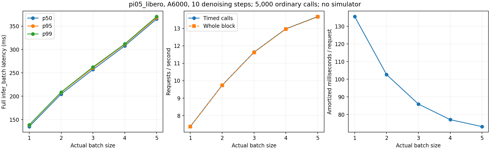
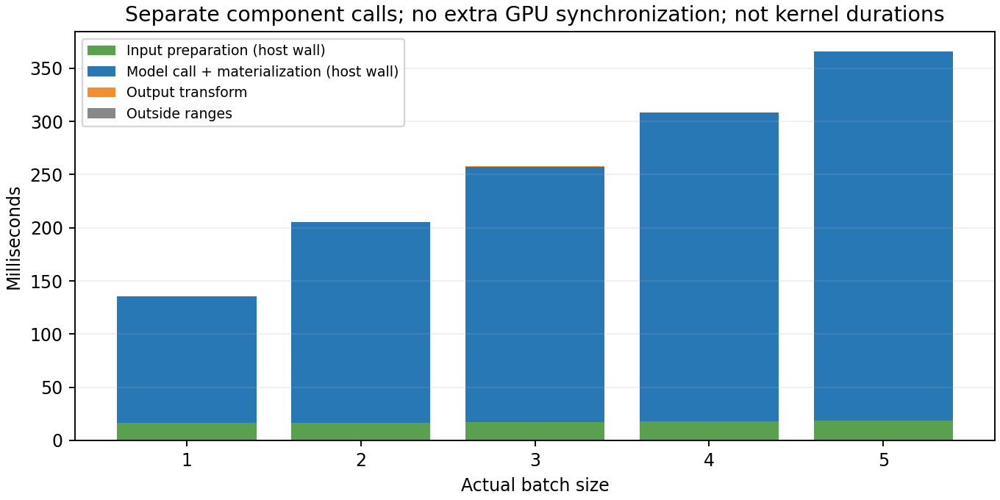
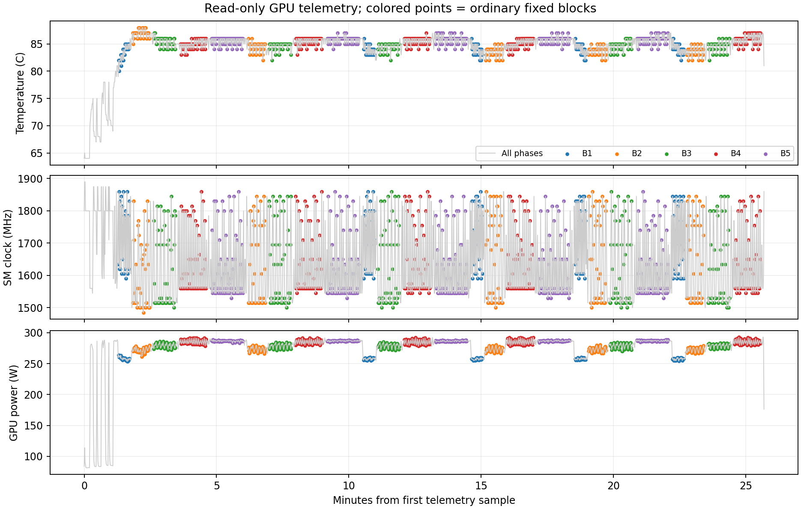

**π0.5 고정 batch 1–5 추론 측정 — deep9, 2026-09-17**

Batch 1–5 각각 1,000회의 일반 추론을 완료했다. B1→B5에서 처리량은 **7.38→13.68 요청/초(1.85배)**로 증가했고, 전체 batch의 p50 latency는 **135.0→365.3ms**로 증가했다. B4→B5의 처리량 증가는 5.4%인 반면 평균 batch latency는 18.6% 늘었다. 이 범위에서 batching의 이득이 줄어드는 경향은 있지만, B5보다 큰 크기를 측정하지 않았으므로 전역 최적 batch나 포화점을 확정하지 않는다.

이 실험의 목적은 로봇 수나 scheduler의 영향을 넣기 전에, A6000 한 장에서 π0.5의 batch별 기본 추론 비용을 확보하는 것이다. 요청 대기·네트워크·로봇 제어·task 성공·starvation은 이 실험의 측정 대상이 아니다. 고정 batch의 처리량을 그대로 특정 로봇 수의 SLO 만족 보장으로 해석하지 않는다.

**고정한 조건**

- GPU 0: RTX A6000 48GB, UUID `GPU-48f8ed9c-ab6c-5134-2277-bd7e0f487b4b`, driver 580.159.04. GPU 1은 사용하지 않았다.
- 환경: Python 3.11.16, JAX/jaxlib 0.5.3, Flax 0.10.2, NumPy 2.4.4.
- 모델 `pi05_libero`, 기존 로컬 checkpoint, JAX 경로, SYNC, 모델 action horizon 10, denoising 10회. action horizon과 denoising 반복 수는 서로 다른 설정이다. 모델 state의 array element 3,353,433,872개가 bfloat16이었다.
- 입력은 LIBERO-10 task `[5,2,6,9,0]`, seed `[7,8,9,10,11]`에서 각각 얻은 초기 관측이다. 실제 관측 5개를 별도 프로세스에서 NPZ로 저장하고, 그 프로세스가 끝난 뒤 추론을 시작했다.
- 각 관측은 224×224×3 uint8 카메라 이미지 2개, state 8개, task prompt를 포함한다. 크기 B에서는 고정 목록의 앞 B개를 사용한다. 이미지·prompt·state는 같은 B의 모든 호출에서 같고, B가 달라지면 목록에 추가되는 관측이 있다. snapshot의 SHA256과 prompt는 입력 metadata에 기록했다.
- 난수 key는 호출 직전에 seed 7의 같은 key로 되돌린다. 이 할당은 timer 밖이며 noise 생성 자체는 정상 추론 경로에 포함된다. B가 달라질 때 noise shape도 달라지므로 서로 다른 B의 출력이 같아야 한다는 가정은 하지 않는다.
- 반환 action은 요청당 NumPy `(10,7)` 배열이다. 호출마다 shape·finite 여부와 해당 B의 warmup 기준 출력과의 일치(`rtol=atol=1e-5`)를 timer 밖에서 검사했다.
- 정책 서버, client, scheduler, 네트워크, LIBERO 렌더러, Nsight는 측정 중 실행하지 않았다. 시스템 Python·드라이버·GPU clock/power/fan 설정은 변경하지 않았다.

**측정 순서와 시간 경계**

각 실제 입력 shape에서 30회 호출하여 최초 컴파일·cuDNN 탐색을 포함한 warmup을 제외했다. 본 측정의 각 블록 앞에서도 같은 B로 10회 더 실행하여 shape 전환을 제외했다. 모든 batch shape를 먼저 준비한 하나의 프로세스에서 다음 순서로 실행했다.

```
반복 1: 1 → 2 → 3 → 4 → 5
반복 2: 2 → 3 → 4 → 5 → 1
반복 3: 3 → 4 → 5 → 1 → 2
반복 4: 4 → 5 → 1 → 2 → 3
반복 5: 5 → 1 → 2 → 3 → 4
```

블록당 일반 호출 200회, 각 B당 1,000회, 총 5,000회다. `perf_counter_ns`로 전체 `infer_batch`를 측정하며 입력 변환·noise 생성·JAX 호출·NumPy materialization·출력 변환이 포함된다. 반환 전에 NumPy로 변환하므로 비동기 dispatch만 측정한 값이 아니다. 최초 컴파일은 warmup에 포함되며 주 통계에서 제외한다. 결과 검증·파일 기록은 일반 호출의 timer 밖이다.

처리량은 두 종류를 분리했다. `timed_service_requests_per_s`는 완료한 요청 수를 추론 timer의 합으로 나눈 값이다. `observed_block_requests_per_s`는 결과 검증과 기록을 포함한 전체 블록 wall time으로 나눈 값이다. 어느 값도 실제 serving의 queueing·batch 대기·통신을 포함하지 않는다. `ms_per_request`는 batch 시간을 B로 나눈 분담 비용이며 각 요청이 실제로 기다리는 응답 시간은 전체 batch 시간에 가깝다.

**Batch별 일반 실행 결과**

| Batch | 호출 수 | 평균 ms | p50 ms | p95 ms | p99 ms | 추론 요청/s | 블록 요청/s | 분담 ms/요청 | 반복 평균 SD ms |
| --- | --- | --- | --- | --- | --- | --- | --- | --- | --- |
| 1 | 1000 | 135.50 | 135.03 | 138.38 | 138.93 | 7.38 | 7.37 | 135.50 | 0.168 |
| 2 | 1000 | 205.27 | 204.62 | 208.13 | 208.88 | 9.74 | 9.73 | 102.63 | 0.289 |
| 3 | 1000 | 257.80 | 257.06 | 260.63 | 262.49 | 11.64 | 11.62 | 85.93 | 0.221 |
| 4 | 1000 | 308.29 | 307.72 | 310.91 | 312.00 | 12.97 | 12.96 | 77.07 | 0.256 |
| 5 | 1000 | 365.63 | 365.27 | 368.20 | 370.45 | 13.68 | 13.66 | 73.13 | 0.191 |

분위수는 각 B의 일반 호출 1,000개를 합쳐 선형 보간으로 계산했다. 블록 평균의 표준편차는 실행 순서·온도·클록 등의 변동을 나타내며 신뢰구간이 아니다. p99는 제한된 tail 표본에 기반하고 시간적으로 연속한 호출들이 독립이라는 가정도 하지 않는다. 블록별 원본 통계는 `block_summary.csv`에 있다.



**별도 호출에서 관찰한 입력 준비·모델 호출·출력 변환**

일반 호출 200회가 끝날 때마다 동일 B로 20회씩 별도 호출했다. B당 100회, 총 500회이며 주 latency 통계에 넣지 않았다. 기존 adapter의 네 구간을 Python wall timer로 기록하고 추가 GPU synchronize나 NVTX/CUPTI 호출을 넣지 않았다. 구간별 시간과 나머지 시간이 전체 timer와 합치되는지 확인했다.

| Batch | 별도 호출 수 | 전체 ms | 입력 준비 ms | 모델 호출+완료 대기 ms | 출력 변환 ms | 기타 ms |
| --- | --- | --- | --- | --- | --- | --- |
| 1 | 100 | 135.72 | 16.40 | 119.13 | 0.083 | 0.099 |
| 2 | 100 | 205.29 | 16.70 | 188.37 | 0.115 | 0.106 |
| 3 | 100 | 257.67 | 17.21 | 240.21 | 0.147 | 0.110 |
| 4 | 100 | 308.39 | 17.95 | 290.14 | 0.179 | 0.117 |
| 5 | 100 | 365.95 | 18.82 | 346.79 | 0.212 | 0.128 |

여기서 입력 준비에는 입력 변환과 noise/batch 준비의 호스트 경로가 포함된다. JAX 작업이 비동기이므로 구간 사이에 GPU 작업이 이어질 수 있다. `sample_dispatch + materialize`에는 모델 호출, 호스트 처리, GPU 완료 대기와 결과 복사가 포함된다. 따라서 이 표를 순수 GPU kernel 시간이나 VLM/action head 시간으로 해석하면 안 된다. VLM과 action 생성 내부의 분해는 다음 profiling 단계의 대상이다.



**GPU 상태와 해석 범위**

실험 자체의 주기적 GPU 점유 감시는 다른 compute PID를 감지하면 이후 진행을 중단한다. 이번 실행에서 충돌은 감지되지 않았다. 본 실행에서 수집에 사용한 `nvidia-smi`는 읽기 전용이며 전력 한도·clock·fan 설정을 바꾸지 않는다.

처음의 매 조회 subprocess 방식은 이 서버에서 드라이버 초기화 비용 때문에 목표 1초보다 느렸다. 본 측정 시작 전에 지속 실행 방식의 `nvidia-smi --loop-ms=1000` 수집을 추가했다. 통계에는 이 스트림의 장치 조회 timestamp를 사용하고, 완료된 일반 측정 블록의 시작·끝 각 1초를 제외한 샘플만 연결했다. warmup·shape 전환·별도 단계 측정은 GPU 통계에서도 제외했다.

| Batch | GPU 샘플 수 | 활동률 평균 % | 전력 평균 W | 메모리 최대 MiB | 온도 평균/최대 °C | SM clock 평균 MHz | SW thermal 샘플 |
| --- | --- | --- | --- | --- | --- | --- | --- |
| 1 | 126 | 87.6 | 257.7 | 8513 | 83.8/86 | 1722 | 12 |
| 2 | 196 | 91.4 | 272.8 | 8513 | 84.5/88 | 1640 | 27 |
| 3 | 249 | 92.9 | 279.1 | 8513 | 84.8/87 | 1622 | 31 |
| 4 | 298 | 94.0 | 285.1 | 8513 | 85.5/87 | 1632 | 42 |
| 5 | 355 | 94.7 | 286.7 | 8513 | 85.8/87 | 1615 | 49 |

메모리는 모든 shape를 미리 컴파일한 공통 프로세스의 **샘플링한 전체 framebuffer 사용량 최대**다. 정확한 kernel 순간 peak 또는 B만 독립 실행할 때의 최소 필요 메모리는 아니다. JAX allocator 통계도 블록마다 저장하지만 high-water mark는 이전 shape까지 포함하므로 batch 고유 peak로 사용하지 않는다.

`utilization.gpu`는 장치의 GPU 활동률 지표이며 SM 연산기나 Tensor Core의 연산 처리율이 아니다. 이 실험에서는 Nsight Compute의 hardware counter를 수집하지 않았다. GPU power는 장치 전력이며 CPU·전체 시스템·로봇의 전력은 포함하지 않는다.

일반 측정에 연결된 GPU 기록은 1,224개이며, 전체 스트림의 실제 샘플 간격 중앙값은 1.001초, p95는 1.001초였다. 일반 측정 중 최대 온도는 88°C였고 SW thermal slowdown 표시가 161개 샘플에서 켜졌다(HW thermal 0개). 따라서 이 결과는 이 서버의 관측된 냉각·동적 클럭 조건에서의 성능이며 고정 클럭 성능은 아니다. batch 순서를 회전시켜 시간 순서 편향을 줄였지만 열 상태를 완전히 통제한 실험은 아니다.

기존 데이터에서 첫 반복만 제외한 B당 800회로 다시 집계했을 때, 평균 latency 변화의 절댓값은 최대 0.059%였다. 이 검사는 최초 반복에 대한 민감도만 확인하며 열 영향이 없다는 증거는 아니다. 블록 평균과 이 보조 집계 CSV를 함께 보존했다.



**검증·재현·원본**

일반 5,000회(개별 요청 15,000개), 별도 구간 측정 500회, 25개 블록의 수와 index를 검증했다. 모든 측정 호출에서 action shape·finite·고정 seed 기준 출력 일치 검사를 통과했다. 별도 구간 시간의 합과 전체 시간이 일치했고, warmup·별도 구간 호출·GPU 경계 샘플이 주 통계에서 제외됐음을 확인했다. 기존 adapter 테스트 4개와 분석 회귀 테스트 2개가 통과했다. 분석 테스트는 일반/별도 호출 혼합 방지, warmup·경계 GPU 기록 제외, timer/블록 처리량 구분을 검사한다.

집계 CSV: [batch 요약](data/2026-09-17-static-summary.csv), [25개 블록](data/2026-09-17-static-block-summary.csv), [별도 구간](data/2026-09-17-static-component-summary.csv), [첫 반복 제외](data/2026-09-17-static-sensitivity.csv). 원본 폴더의 `analysis_validation.json`, `data_integrity_audit.json`, `environment.json`, `manifest.json`에 검증 결과·패키지 버전·실행 조건을 기록했다. PDF 그래프도 원본 폴더에 있다.

실험 완료 후 GPU 0의 compute 프로세스가 사라지고 메모리 사용량이 0 MiB로 돌아온 것을 확인했다. 사용자 tmux의 기존 0·1번 창은 그대로 두었다.

GPU 실행 코드는 `43d02ef`이고 이후 집계·시각화는 별도 스크립트에서 수행했다. 원본은 `output/static_inputs_20260917/` 및 `output/static_inference_20260917/`에 보존한다. 고정 입력·가중치·raw 로그는 Git에 올리지 않는다.

```bash
.venv/bin/python -m scripts.benchmark_fixed_batch capture \
  --gpu 0 --tasks 5 2 6 9 0 --output output/new_static_inputs

.venv/bin/python -u -m scripts.benchmark_static_inference \
  --gpu 0 --inputs output/new_static_inputs --output output/new_static_inference \
  --batches 1 2 3 4 5 --repeats 5 --samples 200 \
  --warmup 30 --block-warmup 10 --components 20

# 위 실행이 manifest를 만든 뒤 별도 터미널에서 시작한다.
.venv/bin/python -u -m scripts.record_gpu_telemetry output/new_static_inference --gpu 0

# 완료 후
.venv/bin/python -m scripts.analyze_static_inference output/new_static_inference
```

**이 결과로 다음에 확인할 질문**

1. B4→B5에서 늘어나는 batch 시간의 원인이 VLM, action 생성 반복, kernel launch/host gap 중 무엇인지 별도 Nsight 실행으로 분해한다. 현재 host 구간 표만으로 특정 GPU stage를 병목으로 지목하지 않는다.
2. 10대가 각각 2Hz로 요청한다면 유입은 20 요청/초다. 이번에 측정한 B1–5의 최대 추론 처리량 13.68 요청/초보다 높으므로, 같은 실행 경로에서 모든 요청을 보존·처리하는 serving은 대기열 증가가 예상된다. Armory가 관측을 교체·생략하는 조건이라면 queue length 대신 처리·대체·누락 수를 구분해야 한다. 실제 로봇 수별 SLO·starvation은 별도 실험으로 확인한다.
3. 이번 데이터는 LIBERO 초기 관측 5개와 SYNC/10 denoising steps에 대한 결과다. 다른 입력 분포, RTC, 다른 생성 길이, Thor 또는 네트워크 조건으로 그대로 일반화하지 않는다. Nsight·multi-robot·Thor 실행은 이번 측정에 포함하지 않았다.
