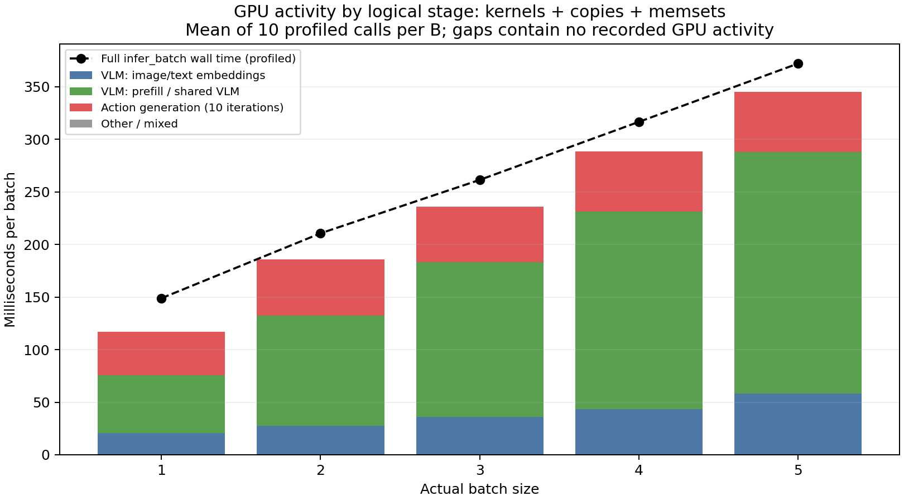
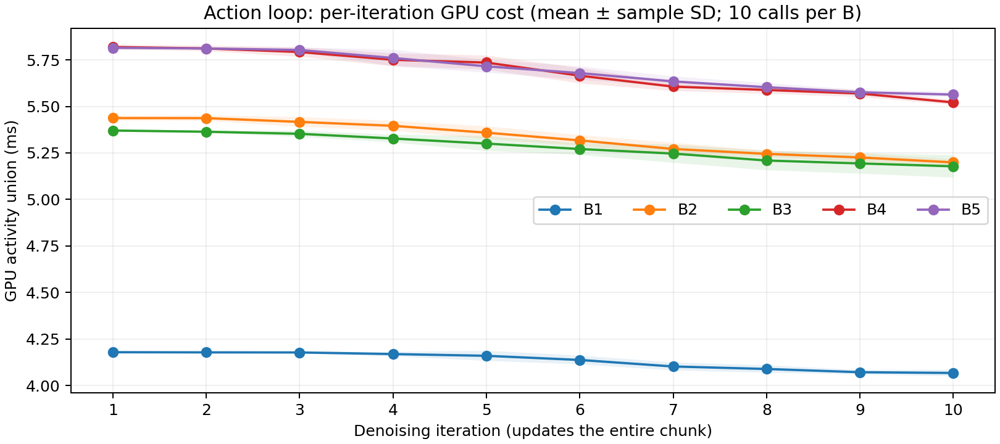
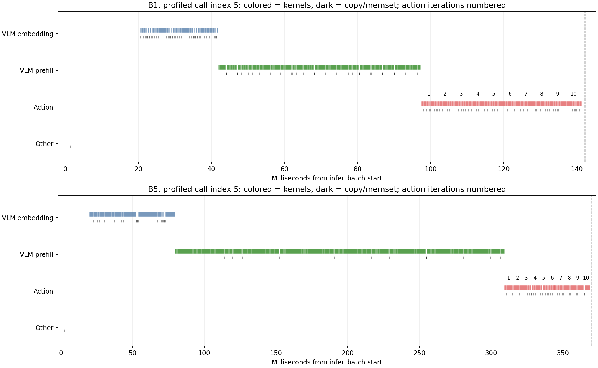

**π0.5 고정 batch 1–5의 VLM·action 생성 비용 — Nsight Systems, 2026-09-17**

2단계 측정을 완료했다. batch별 10회씩 총 50회의 추론을 분석했다. B1→B5에서 VLM GPU activity는 **75.6→288.1ms**, action 생성은 **41.4→57.0ms**였다. 관찰된 GPU activity 증가분의 93.1%가 VLM에 해당한다. 이 조건에서 batch 증가 비용을 설명하는 주된 단계는 **VLM, 특히 prefix prefill**이다.

이는 정적 추론의 내부 비용 분해다. [1단계 일반 성능 측정](2026-09-17-static-inference.md)의 latency·처리량을 대체하지 않으며 scheduler, queueing, 네트워크, 로봇 실행, task 성공률은 측정하지 않았다. Nsight Systems로 관찰한 시간만으로 compute-bound/memory-bound 또는 Tensor Core 활용률을 확정하지 않는다.

**조건과 입력**

- deep9 GPU 0, RTX A6000 48GB, UUID `GPU-48f8ed9c-ab6c-5134-2277-bd7e0f487b4b`; driver 580.159.04. GPU 1은 사용하지 않았다.
- Python 3.11.16, JAX/jaxlib 0.5.3, Flax 0.10.2, NumPy 2.4.4. Nsight Systems 2025.6.3.343, `/usr/local/cuda-13.2/bin/nsys`.
- `pi05_libero`, 기존 로컬 checkpoint, JAX SYNC 경로, denoising 10회, action horizon 10. 모델 state array는 bf16. 모델 내부 action `(B,10,32)`, 반환 action은 요청당 NumPy `(10,7)`.
- 1단계와 같은 실제 LIBERO 초기 관측 5개, task `[5,2,6,9,0]`, seed `[7,8,9,10,11]`. B에는 앞 B개를 넣고, 각 호출의 모델 난수 key는 seed 7로 고정한다. 파일 SHA256은 manifest에 보존했다.
- 요청당 실제 RGB 영상 2개 `(224,224,3) uint8`, state `(8,) float64`, 문자열 prompt. 모델 경계에서는 이미지 3슬롯(패딩 포함), 각각 `(B,224,224,3) float32`, prompt ID `(B,200) int32`, mask `bool`, state `(B,32) float32`. 유효 prompt token 수는 `[16,14,20,14,14]`이며 나머지는 padding이다. 상세 규격과 재구성 방법은 1단계 보고서에 있다.
- GPU 실행 코드 `56c6d5b`. 모든 B를 먼저 컴파일하고 B당 30회 warmup했다. capture 전 B당 10회, capture 안의 전환 호출 3회·공식 호출 10회, 마지막 추가 호출 10회를 실행했다. **마지막 추가 호출은 수집 중이므로 capture-off 대조군에 넣지 않았다.**
- 공식 통계는 `phase=profile` 50회만 사용한다. warmup 외 165회 모두 출력 shape·finite·고정 seed 기준 출력 일치(`rtol=atol=1e-5`)를 검사했다.

**무엇을 VLM과 action으로 나눴는가**

| 단계 | 기존 모델 메서드 | 포함하는 연산 |
| --- | --- | --- |
| VLM embedding | `Pi0.embed_prefix` | 이미지 인코더(SigLIP), prompt embedding, prefix 구성 |
| VLM prefix prefill | `Pi0.prefill` | PaliGemma의 prefix forward와 KV cache 생성 |
| Action generation | `Pi0.flow_matching` | suffix·timestep embedding, action expert, velocity projection 및 전체 chunk 갱신을 10회 반복 |

소스는 [pi0.py](../../third_party/openpi/src/openpi/models/pi0.py)다. **denoising iteration 1회는 chunk 전체를 갱신하는 추론 반복**이다. 로봇 action 1개나 환경 step 1개가 아니다. 이 실험에서 denoising 횟수와 출력 action 개수가 둘 다 10인 것은 별개 설정이다.

원래 하나의 `module_jit`를 유지하면서 위 메서드에 임시 `jax.named_scope`를 추가했다. JIT를 단계별로 분리하거나 단계 사이에 GPU synchronize를 넣지 않았다. 각 B에서 annotation 전후의 **debug 정보 제외 StableHLO 문자열과 SHA256이 일치**함을 확인했다. 이 검사는 연산 그래프가 그대로임을 확인하며, 별도 컴파일 간 autotuning 결과나 kernel 구성까지 항상 같다는 뜻은 아니다. CUDA graph 설정도 기본값으로 유지했다(`XLA_FLAGS` 빈 문자열).

JIT 내부의 `named_scope`는 XLA metadata를 남기며, CPU NVTX 구간 자체가 GPU 실행 시간은 아니다. NVIDIA도 JIT 내부에서는 `named_scope`를 사용하고 상위 호출에서 NVTX를 사용하도록 설명한다. [NVIDIA JAX profiling 안내](https://docs.nvidia.com/jax-toolbox/performance-profiling/profiling)

GPU 이벤트의 `(process, correlation ID)`를 CUDA launch API에 연결하고, **그 API의 CPU thread**를 둘러싼 XLA thunk와 해당 B의 optimized HLO를 이용해 stage를 분류했다. 공통 fusion이 여러 곳에서 재사용되어 source metadata가 섞이는 경우 실행 중인 loop의 call-site metadata를 우선한다. 개별 GPU kernel 이름만으로 VLM/action을 추측하지 않는다.

**단계별 결과: 단위 ms / batch 호출**

아래 stage 시간은 CUDA kernel·memcpy·memset 실행 구간의 **합집합 길이**다. GPU stream의 겹침을 이중 합산하지 않는다. 단계 사이 host gap은 각 stage에 억지로 배분하지 않았다. VLM 합계는 앞의 두 열을 합한 값이다. Prefill 열에는 embedding/prefill 공통 metadata로 분류된 GPU activity(B1 약 0.10ms, 나머지 B는 0ms)를 포함했다.

| B | VLM embedding | VLM prefill | VLM 합계 | Action 10회 합계 | 전체 호출 wall | GPU activity 밖 wall |
| --- | --- | --- | --- | --- | --- | --- |
| 1 | 20.39 | 55.21 | **75.60** | **41.35** | 148.91 | 31.84 |
| 2 | 27.76 | 104.77 | **132.53** | **53.33** | 210.68 | 24.64 |
| 3 | 35.77 | 147.26 | **183.03** | **52.84** | 261.47 | 25.37 |
| 4 | 43.50 | 188.08 | **231.59** | **56.89** | 316.67 | 27.92 |
| 5 | 58.43 | 229.71 | **288.15** | **56.99** | 372.10 | 26.70 |

VLM이 기록된 GPU activity에서 차지하는 비율은 B1 **64.6%**, B5 **83.4%**다. B1→B5의 VLM 증가는 3.81배, action 증가는 1.38배다. 요청당 분담 비용은 batch로 나눌 수 있지만, 개별 요청이 완료되는 latency는 전체 batch 시간에 대응한다.

`GPU activity 밖 wall`은 `전체 호출 wall − 기록된 모든 GPU activity의 합집합`이다. CPU 전처리·dispatch·GPU 작업 사이 공백 등이 들어갈 수 있으며, **순수 CPU 연산 시간이나 통신 시간으로 해석하지 않는다**. host synchronize 구간은 GPU 실행과 겹치므로 별도 덧셈 항으로 사용하지 않는다. 미분류 GPU activity는 최대 약 0.10%이며 stage 표의 합계와 전체 GPU activity 차이에 해당한다.



**Action 내부 10회 반복과 수집 오버헤드**

| B | Capture 전 호출 평균 ms | Profile 호출 평균 ms | 전 대조군 대비 변화 | Denoising 1회 GPU activity 평균 ms |
| --- | --- | --- | --- | --- |
| 1 | 135.78 | 148.91 | 9.67% | 4.13 |
| 2 | 204.10 | 210.67 | 3.22% | 5.33 |
| 3 | 253.87 | 261.46 | 2.99% | 5.28 |
| 4 | 309.58 | 316.66 | 2.29% | 5.69 |
| 5 | 365.27 | 372.09 | 1.87% | 5.70 |

대조군도 Nsight가 실행한 동일 프로세스 안의 capture-off 호출이다. 이 비교는 수집 활성화 전후의 관측 차이이며 순수한 profiler 비용만 분리한 인과 추정은 아니다. 온도·클럭과 실행 순서도 영향을 줄 수 있다. profile 호출은 B당 10회뿐이므로 tail latency나 신뢰구간을 주장하지 않는다. 일반 latency·처리량은 B당 1,000회를 수행한 1단계 결과를 사용한다.

B1의 전체 호출은 140.37–158.88ms로 변했지만 GPU activity는 116.92–117.22ms였다. 큰 변동은 GPU activity 밖의 wall 시간에 나타났으며, 원인을 profiler·CPU scheduling 등으로 더 세분해 확정하지 않았다. B1의 capture 전 대비 약 9.67% 증가를 숨기거나 이상치로 제거하지 않았다.

모든 공식 호출에서 외부 action while-loop body가 정확히 10회 관찰됐다. 그림은 iteration별 GPU activity의 평균과 호출 간 표본 표준편차이며, 표의 action 합계에는 loop 밖의 작은 준비 연산도 포함될 수 있다.





Timeline은 각 B의 고정 index 5 호출이며 빠르거나 느린 호출을 골라내지 않았다. 색 선은 kernel, 진한 선은 copy/memset이다. 숫자 1–10은 denoising 반복이며 검은 점선은 전체 호출 완료 시점이다. stage lane은 분석기가 분류한 GPU 이벤트이지 GPU에서 실행되는 Python 함수 범위가 아니다.

**복사 비용도 분리했다**

| B | H2D MB/호출 | H2D ms | D2H KB/호출 | D2H ms | D2D GB/호출 | D2D ms |
| --- | --- | --- | --- | --- | --- | --- |
| 1 | 0.453 | 0.075 | 2.699 | 0.016 | 5.673 | 16.578 |
| 2 | 0.905 | 0.125 | 5.387 | 0.016 | 5.673 | 16.556 |
| 3 | 1.358 | 0.172 | 8.075 | 0.018 | 5.673 | 16.641 |
| 4 | 1.811 | 0.203 | 10.763 | 0.016 | 5.673 | 16.871 |
| 5 | 2.264 | 0.180 | 13.451 | 0.016 | 5.673 | 16.953 |

MB/KB/GB는 10진 단위다. 이 값들은 stage 시간에 **이미 포함**되어 있으므로 다시 더하면 안 된다. H2D는 호스트→GPU, D2H는 GPU→호스트, D2D는 GPU 내부 복사다. 관찰된 D2D 약 5.67GB/호출은 **네트워크 전송량도, 모든 GPU DRAM 접근량도 아니다**. CUDA memcpy 이벤트의 byte 합계이며 kernel 자체의 load/store는 포함하지 않는다. 구체적인 tensor·가중치 복사 원인 및 메모리 대역폭 병목 여부는 추가 분석 대상이다.

**수집 품질과 GPU 상태**

최종 trace에서 추론 프로세스의 CUDA/NVTX 수집 경고는 **0개**다. 공식 50회에서 GPU 이벤트 446,300개 전부 CUDA API correlation과 연결됐다. Kernel 시간의 단계 분류 coverage는 최소 99.979%, 복사 포함 activity coverage는 최소 99.900%다. 모든 호출에서 action 반복 수 10회, B별 kernel 개수 일관성, NVTX와 Python timer 일치(최대 차이 0.0076ms)를 확인했다. 이는 수집·분류 일관성 검사이며 모든 종류의 profiler 교란이 없다는 보장은 아니다.

처음 두 B1–5 trace는 `capture-range-end=stop`에서 importer의 “Not all CUDA/NVTX events might have been collected” 경고가 발생했다. 외부 GPU 감시로 옮겨도 남았고, 짧은 JAX 예제로 종료 방식을 비교했다. **`--capture-range-end=none`으로 프로세스 정상 종료까지 수집한 최종 trace**를 보고서에 사용했다. 앞선 경고 trace는 진단용으로 보존하고 최종 수치에 섞지 않았다. 경고의 HostTimestamp는 importer의 시간이며 추론 중 해당 시점에서 손실됐다는 의미로 읽지 않는다. 이 관찰만으로 Nsight 내부의 정확한 버그 원인을 확정하지 않는다.

GPU 상태 감시는 Nsight 대상 프로세스 밖에서 수행했다. 공식 측정의 첫 호출 시작부터 마지막 호출 종료까지 1Hz 기록 16개에서 온도 83–87°C, SM clock 1530–1860MHz, framebuffer 최대 8548MiB를 관찰했다. 이 구간에는 호출 사이 검증과 batch 전환이 포함된다. SW thermal slowdown 2개, HW thermal 0개 샘플이었다. 고정 클럭이나 열 상태 통제 실험은 아니며, 이 서버의 당시 조건에서 얻은 결과다. 시스템·드라이버·clock·power·fan 설정은 변경하지 않았다. 측정과 상태 감시 프로세스가 정상 종료했고 GPU 0·1의 사용 메모리가 0MiB로 돌아왔음을 확인했다. 기존 tmux 0·1번 창은 유지했다.

**직접 열어볼 파일과 재현**

최종 Nsight GUI 파일:

`/home/jyjeong/armory/output/static_stages_20260917/main_graph_exit/timeline.nsys-rep`

GUI에서 `armory.stage_call phase=profile b=1 i=5` 또는 `b=5 i=5`를 검색한 뒤 CUDA HW, CUDA API, NVTX/TSL 행을 펼친다. `armory_stage_vlm_embed`, `armory_stage_vlm_prefill`, `armory_stage_action`은 XLA thunk/HLO metadata의 이름이다. standalone Python NVTX stage 범위 세 개로 보이는 방식은 아니다. `transition`, `after_traced`는 공식 통계에서 제외한다. GUI 사용 방법은 [NVIDIA 안내](https://docs.nvidia.com/jax-toolbox/performance-profiling/profiling)를 참고할 수 있다.

원본 폴더에는 `.nsys-rep`, `timeline.sqlite`, `run/`의 입력 hash·HLO·호출 로그·GPU 상태, `analysis/`의 GPU 이벤트 CSV·검증·PNG/PDF가 있다. raw trace·checkpoint·관측 파일은 Git에 올리지 않는다. 공유용 [요약 CSV](data/2026-09-17-static-stages-summary.csv), [호출별 CSV](data/2026-09-17-static-stages-calls.csv), [반복별 CSV](data/2026-09-17-static-stages-action_steps.csv), [검증 JSON](data/2026-09-17-static-stages-validation.json), [실행 manifest](data/2026-09-17-static-stages-manifest.json)를 보존했다.

같은 입력 snapshot을 재사용하고, 두 터미널에서 감시와 실험을 연이어 시작한다. 출력 폴더는 새 경로를 사용한다.

```bash
# 터미널 1: manifest가 생길 때까지 최대 120초 기다린다.
.venv/bin/python -m scripts.watch_profile_gpu output/new_static_stages/run --gpu 0

# 터미널 2
mkdir -p output/new_static_stages
/usr/local/cuda-13.2/bin/nsys profile \
  --sample=none --cpuctxsw=none --trace=cuda,nvtx --cuda-graph-trace=node \
  --capture-range=cudaProfilerApi --capture-range-end=none --kill=none \
  --output=output/new_static_stages/timeline \
  .venv/bin/python -u -m scripts.profile_static_stages \
  --gpu 0 --external-observer --capture-until-exit \
  --inputs output/static_inputs_20260917 --output output/new_static_stages/run \
  --batches 1 2 3 4 5 --samples 10 --controls 10 --warmup 30

# 실행이 끝난 뒤
/usr/local/cuda-13.2/bin/nsys export --type sqlite \
  --output=output/new_static_stages/timeline.sqlite \
  output/new_static_stages/timeline.nsys-rep
.venv/bin/python -m scripts.analyze_static_stages output/new_static_stages
.venv/bin/python -m scripts.plot_static_stages output/new_static_stages
```

**연구 질문에 주는 의미**

이번 입력·모델·장치에서는 B를 늘릴 때 action 생성 전체를 동일한 비율로 비싸게 만드는 것이 아니라 VLM prefix 처리 비용이 더 크게 증가했다. 따라서 batch 비용을 하나의 상수나 B에 정비례하는 값으로 두기보다, VLM과 action의 서로 다른 scaling을 모델링할 근거가 생겼다. VLM prefill의 상위 kernel을 대상으로 Nsight Compute를 사용하면 compute/memory 원인을 추가로 좁힐 수 있다. 별도 stage batching·cache 재사용·모델 분할이 실제로 유리한지는 아직 실험하지 않았다. 제어 deadline·요청 교체·starvation 및 multi-robot scheduling에 대한 주장은 다음 serving 실험에서 검증해야 한다.

분석기 회귀 테스트와 GPU interval 합집합 테스트 5개가 통과했다. Ruff 검사와 보고서 내 로컬 링크 검증도 완료했다.

후속 실험: [Nsight Compute로 선택한 prefill GEMM의 카운터 측정](2026-09-17-ncu-prefill.md).

후속 [VLM·action 구간 자원 사용률 측정](2026-09-17-stage-resources.md)에서 전체 GPU 활동 구간의 Tensor/SM 시계열과 NCU 메모리·warp·stall 지표를 추가 수집했다.
